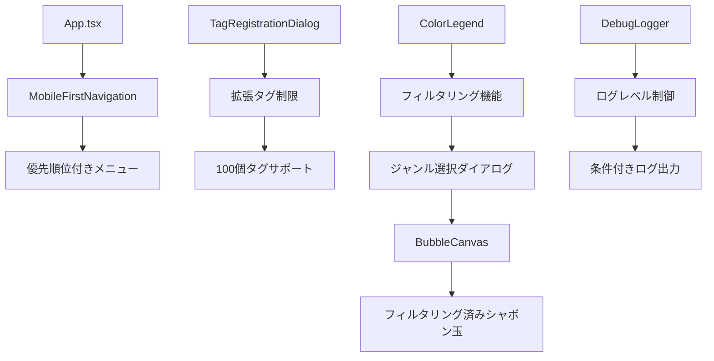

# 設計書

## 概要

この設計書は、音楽シャボン玉エクスプローラーアプリケーションの追加機能強化を定義します。タグ制限の緩和（10個→100個）、メニュー順序の最適化、ログ出力の抑制、およびジャンル別フィルタリング機能の追加を含みます。既存のアーキテクチャを活用しながら、ユーザビリティとパフォーマンスを向上させることを目標とします。

## アーキテクチャ

### 現在のアーキテクチャ分析

現在のアプリケーションは以下の構造を持っています：

- **ナビゲーションシステム**: `MobileFirstNavigation`コンポーネントによるメニュー管理
- **タグ管理システム**: `TagRegistrationDialog`と`TagSelectionView`によるタグ登録機能
- **シャボン玉システム**: `BubbleCanvas`と`ColorLegend`による表示・凡例機能
- **データ管理**: `MusicDataService`による楽曲・タグデータ管理
- **ログシステム**: `DebugLogger`とコンソール出力による開発者向け情報表示

### 改善されたアーキテクチャ



## コンポーネントと インターフェース

### 1. タグ制限緩和システム

#### 拡張TagRegistrationService
```typescript
interface EnhancedTagRegistrationConfig {
  maxTagsPerSong: number // 100に変更
  warningThreshold: number // 80個で警告表示
  validationRules: {
    maxTagLength: number
    allowedCharacters: RegExp
    duplicateCheck: boolean
  }
}

interface TagLimitValidation {
  isValid: boolean
  currentCount: number
  maxCount: number
  warningMessage?: string
  errorMessage?: string
}
```

**主要機能:**
- タグ制限を10個から100個に拡張
- 80個到達時の警告表示
- タグ数カウンター表示
- バリデーション強化

#### TagSelectionView拡張
```typescript
interface EnhancedTagSelectionViewProps extends TagSelectionViewProps {
  maxTags: number
  showTagCounter: boolean
  onTagLimitWarning: (count: number, limit: number) => void
}
```

**改善点:**
- リアルタイムタグ数表示
- 制限近接時の視覚的警告
- スクロール可能なタグリスト
- 一括選択・解除機能

### 2. メニュー順序最適化システム

#### 改善されたMobileFirstNavigation
```typescript
interface OptimizedNavigationItem {
  id: string
  label: string
  icon: string
  priority: number // 表示順序を制御
  view: NavigationView
  isActive: boolean
  color: string
  onClick: () => void
}

const OPTIMIZED_MENU_ORDER = [
  { id: 'tag-registration', priority: 1 }, // 最優先
  { id: 'tag-list', priority: 2 },
  { id: 'manage-songs', priority: 3 },
  { id: 'add-song', priority: 4 },
] as const
```

**変更点:**
- タグ登録を最上位に移動
- タグ一覧を2番目に配置
- 楽曲編集を3番目に配置
- 楽曲登録を4番目に配置

### 3. ログ出力抑制システム

#### EnhancedDebugLogger
```typescript
enum LogLevel {
  NONE = 0,     // ログ出力なし
  ERROR = 1,    // エラーのみ
  WARN = 2,     // 警告以上
  INFO = 3,     // 情報以上
  DEBUG = 4,    // 全てのログ
}

interface LogConfig {
  level: LogLevel
  enableConsole: boolean
  enableProduction: boolean
  filterPatterns: string[]
}

class ProductionLogger {
  private config: LogConfig
  
  log(level: LogLevel, message: string, data?: any): void
  error(message: string, error?: Error): void
  warn(message: string, data?: any): void
  info(message: string, data?: any): void
  debug(message: string, data?: any): void
}
```

**実装方法:**
- 本番環境では ERROR レベルのみ出力
- 開発環境では設定可能なログレベル
- コンソール出力の条件付き制御
- 不要なログの自動フィルタリング

### 4. ジャンル別フィルタリングシステム

#### GenreFilterDialog コンポーネント
```typescript
interface GenreFilterDialogProps {
  isVisible: boolean
  availableGenres: string[]
  selectedGenres: string[]
  onGenreToggle: (genre: string) => void
  onApplyFilter: (genres: string[]) => void
  onClearFilter: () => void
  onClose: () => void
}

interface GenreFilterState {
  selectedGenres: Set<string>
  isFilterActive: boolean
  filteredBubbleCount: number
}
```

**主要機能:**
- 利用可能なジャンル一覧表示
- 複数ジャンル選択対応
- フィルター状態の視覚的表示
- リアルタイムプレビュー

#### 拡張ColorLegend
```typescript
interface InteractiveColorLegendProps extends ColorLegendProps {
  onLegendClick: () => void
  isFilterActive: boolean
  filteredCount?: number
  totalCount?: number
}
```

**改善点:**
- クリック可能な凡例アイコン
- フィルター状態の視覚的表示
- フィルタリング結果のカウント表示
- タップ操作の最適化

### 5. BubbleCanvas フィルタリング統合

#### FilteredBubbleCanvas
```typescript
interface BubbleFilterConfig {
  activeGenres: Set<string>
  isFilterActive: boolean
  filterMode: 'include' | 'exclude'
}

interface FilteredBubbleEntity extends BubbleEntity {
  genres: string[]
  isVisible: boolean
  filterMatch: boolean
}
```

**フィルタリングロジック:**
- ジャンルベースの表示制御
- アニメーション付きフィルタリング
- パフォーマンス最適化
- 状態保持機能

## データモデル

### 拡張タグ管理データモデル
```typescript
interface EnhancedTagData {
  songId: string
  tags: string[]
  maxTags: number
  createdAt: Date
  updatedAt: Date
  validationStatus: {
    isValid: boolean
    warnings: string[]
    errors: string[]
  }
}

interface TagLimitSettings {
  maxTagsPerSong: number
  warningThreshold: number
  enforceLimit: boolean
  allowOverride: boolean
}
```

### ジャンルフィルタリングデータモデル
```typescript
interface GenreFilterData {
  availableGenres: string[]
  selectedGenres: string[]
  filterHistory: FilterHistoryItem[]
  preferences: {
    rememberLastFilter: boolean
    defaultGenres: string[]
  }
}

interface FilterHistoryItem {
  genres: string[]
  timestamp: Date
  resultCount: number
}
```

### ログ設定データモデル
```typescript
interface LogSettings {
  level: LogLevel
  enabledInProduction: boolean
  filterRules: LogFilterRule[]
  outputTargets: LogOutputTarget[]
}

interface LogFilterRule {
  pattern: string
  action: 'include' | 'exclude'
  level: LogLevel
}
```

## エラーハンドリング

### タグ制限エラー処理
```typescript
enum TagLimitError {
  LIMIT_EXCEEDED = 'LIMIT_EXCEEDED',
  INVALID_TAG_FORMAT = 'INVALID_TAG_FORMAT',
  DUPLICATE_TAG = 'DUPLICATE_TAG',
  SAVE_FAILED = 'SAVE_FAILED'
}

interface TagLimitErrorHandler {
  handleLimitExceeded(currentCount: number, limit: number): void
  showWarning(count: number, threshold: number): void
  validateTagFormat(tag: string): boolean
}
```

### フィルタリングエラー処理
```typescript
interface FilterErrorHandler {
  handleInvalidGenre(genre: string): void
  handleFilterFailure(error: Error): void
  recoverFromFilterError(): void
}
```

## テスト戦略

### 1. ユニットテスト
- **TagLimitValidation**: タグ制限チェックロジック
- **MenuOrderOptimization**: メニュー順序制御
- **LogLevelControl**: ログレベル制御機能
- **GenreFiltering**: ジャンルフィルタリングロジック

### 2. インテグレーションテスト
- **拡張タグ登録フロー**: 100個タグ登録テスト
- **メニューナビゲーション**: 新しい順序での操作テスト
- **フィルタリング統合**: 凡例クリックからフィルタリングまで

### 3. パフォーマンステスト
- **大量タグ処理**: 100個タグでの動作確認
- **フィルタリング速度**: 大量シャボン玉でのフィルタリング性能
- **ログ出力影響**: ログ抑制によるパフォーマンス改善測定

## 実装フェーズ

### フェーズ1: タグ制限緩和
1. TagRegistrationServiceの拡張
2. TagSelectionViewの改善
3. バリデーション強化
4. UI改善（カウンター表示）

### フェーズ2: メニュー順序最適化
1. MobileFirstNavigationの順序変更
2. 既存機能の動作確認
3. アクセシビリティ対応
4. レスポンシブ対応

### フェーズ3: ログ出力抑制
1. ProductionLoggerの実装
2. 既存ログ出力の置き換え
3. 設定可能なログレベル
4. 本番環境での動作確認

### フェーズ4: ジャンルフィルタリング
1. GenreFilterDialogの実装
2. ColorLegendの拡張
3. BubbleCanvasフィルタリング統合
4. 状態管理の実装

### フェーズ5: 統合・テスト
1. 全機能の統合テスト
2. パフォーマンス検証
3. ユーザビリティテスト
4. 既存機能の回帰テスト

## パフォーマンス考慮事項

### 1. 大量タグ処理最適化
- 仮想スクロールによるタグリスト表示
- 遅延読み込みによるメモリ使用量削減
- インデックス化による検索性能向上

### 2. フィルタリング最適化
- WebWorkerによるフィルタリング処理
- メモ化による再計算回避
- 段階的フィルタリングによる応答性向上

### 3. ログ出力最適化
- 条件付きログ生成による処理負荷削減
- バッファリングによる出力効率化
- 本番環境での完全無効化

## セキュリティ考慮事項

### 1. タグデータ検証
- XSS攻撃防止のためのサニタイゼーション
- SQLインジェクション対策
- 入力値の厳密な検証

### 2. ログ情報保護
- 個人情報のログ出力防止
- 機密情報のマスキング
- ログレベルによる情報制御

## 互換性とブラウザサポート

### サポート対象
- **デスクトップ**: Chrome 90+, Firefox 88+, Safari 14+, Edge 90+
- **モバイル**: iOS Safari 14+, Chrome Mobile 90+, Samsung Internet 14+

### フォールバック戦略
- Set/Map未対応ブラウザ向けPolyfill
- IntersectionObserver未対応時の代替実装
- localStorage未対応時のメモリ保存

## 設定管理

### アプリケーション設定
```typescript
interface AppEnhancementConfig {
  tagLimits: {
    maxTagsPerSong: number
    warningThreshold: number
  }
  menuOrder: string[]
  logging: {
    level: LogLevel
    enableInProduction: boolean
  }
  filtering: {
    enableGenreFilter: boolean
    rememberLastFilter: boolean
  }
}
```

### 環境別設定
- **開発環境**: 全ログ有効、デバッグ機能有効
- **ステージング環境**: 警告以上のログ、テスト機能有効
- **本番環境**: エラーログのみ、最適化モード