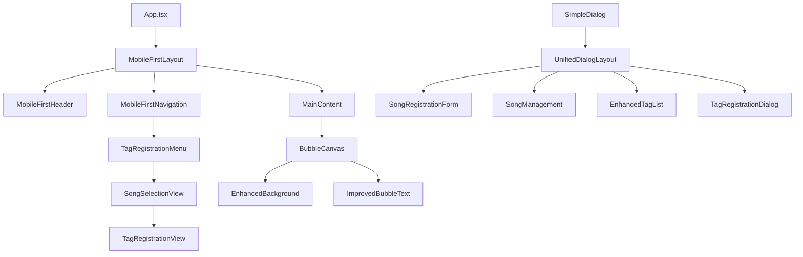

# 設計書

## 概要

この設計書は、音楽シャボン玉エクスプローラーアプリケーションの包括的な改善を定義します。新しいタグ登録機能の追加、モバイルファーストレイアウトの修正、視覚的強化、UI一貫性の改善を含みます。既存のアーキテクチャを活用しながら、ユーザビリティとパフォーマンスを向上させることを目標とします。

## アーキテクチャ

### 現在のアーキテクチャ分析

現在のアプリケーションは以下の構造を持っています：

- **レイアウトシステム**: `MobileFirstLayout`コンポーネントによるレスポンシブレイアウト
- **ナビゲーションシステム**: `MobileFirstNavigation`コンポーネントによるデスクトップ/モバイル対応
- **ダイアログシステム**: `SimpleDialog`コンポーネントによる統一されたモーダル表示
- **データ管理**: `MusicDataService`と`DataManager`による楽曲・タグデータ管理
- **シャボン玉システム**: `BubbleCanvas`と各種マネージャーによる描画・アニメーション

### 改善されたアーキテクチャ



## コンポーネントと インターフェース

### 1. 新規タグ登録機能

#### TagRegistrationDialog コンポーネント
```typescript
interface TagRegistrationDialogProps {
  isVisible: boolean
  onClose: () => void
  onTagsRegistered: (songId: string, tags: string[]) => void
}

interface TagRegistrationState {
  selectedSong: Song | null
  availableTags: string[]
  selectedTags: string[]
  newTags: string[]
  searchTerm: string
}
```

**主要機能:**
- 楽曲選択インターフェース（高い視認性のリスト表示）
- タグ選択・追加インターフェース（既存タグの候補表示）
- 簡単操作のためのワンクリック/タップ操作
- リアルタイム検索とフィルタリング

#### SongSelectionView コンポーネント
```typescript
interface SongSelectionViewProps {
  songs: Song[]
  onSongSelect: (song: Song) => void
  searchTerm: string
  onSearchChange: (term: string) => void
}
```

**表示特徴:**
- グリッドまたはリスト表示の切り替え
- 楽曲情報の詳細表示（タイトル、アーティスト、既存タグ）
- 高速スクロールとページネーション
- モバイル最適化されたタッチ操作

### 2. レイアウト改善システム

#### 改善されたMobileFirstLayout
```typescript
interface EnhancedMobileFirstLayoutProps extends MobileFirstLayoutProps {
  fixedBottomNavigation: boolean
  headerHeight: 'compact' | 'standard'
  contentPadding: 'minimal' | 'standard'
}
```

**改善点:**
- ヘッダー高さの動的調整（PC: 60px、モバイル: 50px、ランドスケープ: 45px）
- ボトムナビゲーションの完全固定化
- セーフエリア対応の強化
- スクロール領域の最適化

#### 統一ダイアログレイアウト
```typescript
interface UnifiedDialogLayoutProps {
  title: string
  children: React.ReactNode
  size: 'compact' | 'standard' | 'large'
  mobileOptimized: boolean
}
```

**特徴:**
- モバイルでのコンパクト表示
- 縦スクロールの最小化
- 統一されたヘッダー・フッター
- アクセシビリティ対応

### 3. 視覚的強化システム

#### EnhancedBubbleBackground コンポーネント
```typescript
interface BubbleBackgroundProps {
  width: number
  height: number
  theme: 'chestnut' | 'default'
  intensity: 'subtle' | 'moderate' | 'vibrant'
  performanceMode: boolean
}
```

**実装方法:**
- CSS背景グラデーションによる栗モチーフ
- SVGパターンによる装飾要素
- パフォーマンス最適化されたアニメーション
- シャボン玉との視覚的干渉の回避

#### ImprovedBubbleTextRenderer
```typescript
interface BubbleTextConfig {
  maxTextLength: number
  allowOverflow: boolean
  fontSizeRange: [number, number]
  ellipsisThreshold: number
}
```

**改善点:**
- より多くの文字数の表示（現在の制限を緩和）
- 軽微なはみ出しの許可
- 動的フォントサイズ調整
- 読みやすさの優先

## データモデル

### TagRegistration データモデル
```typescript
interface TagRegistration {
  id: string
  songId: string
  tags: string[]
  createdAt: Date
  updatedAt: Date
}

interface TagRegistrationSession {
  sessionId: string
  selectedSongs: Song[]
  pendingRegistrations: TagRegistration[]
  completedCount: number
}
```

### EnhancedUISettings データモデル
```typescript
interface UISettings {
  layout: {
    headerHeight: number
    navigationHeight: number
    contentPadding: number
    dialogSize: 'compact' | 'standard'
  }
  visual: {
    backgroundTheme: 'chestnut' | 'default'
    bubbleTextLength: number
    allowTextOverflow: boolean
  }
  mobile: {
    fixedNavigation: boolean
    compactDialogs: boolean
    safeAreaHandling: boolean
  }
}
```

## エラーハンドリング

### タグ登録エラー処理
```typescript
enum TagRegistrationError {
  SONG_NOT_FOUND = 'SONG_NOT_FOUND',
  TAG_LIMIT_EXCEEDED = 'TAG_LIMIT_EXCEEDED',
  INVALID_TAG_FORMAT = 'INVALID_TAG_FORMAT',
  SAVE_FAILED = 'SAVE_FAILED'
}

interface TagRegistrationErrorHandler {
  handleError(error: TagRegistrationError, context: any): void
  showUserFriendlyMessage(error: TagRegistrationError): string
  suggestRecoveryAction(error: TagRegistrationError): string
}
```

### レイアウトエラー処理
```typescript
interface LayoutErrorRecovery {
  detectLayoutIssues(): LayoutIssue[]
  applyFallbackLayout(): void
  reportLayoutMetrics(): LayoutMetrics
}
```

## テスト戦略

### 1. ユニットテスト
- **TagRegistrationDialog**: タグ選択・登録ロジック
- **SongSelectionView**: 楽曲検索・フィルタリング
- **EnhancedBubbleBackground**: 背景レンダリング
- **ImprovedBubbleTextRenderer**: テキスト表示ロジック

### 2. インテグレーションテスト
- **タグ登録フロー**: 楽曲選択からタグ保存まで
- **レイアウト応答性**: 画面サイズ変更時の動作
- **ダイアログ統一性**: 各ダイアログの一貫した動作

### 3. ビジュアルリグレッションテスト
- **モバイルレイアウト**: iPhone各機種での表示確認
- **ダイアログ表示**: 各ダイアログのレイアウト確認
- **シャボン玉背景**: 視覚的強化の確認

### 4. パフォーマンステスト
- **背景レンダリング**: 新しい背景のパフォーマンス影響
- **大量タグ処理**: 多数のタグがある場合の動作
- **モバイル応答性**: タッチ操作の応答速度

### 5. アクセシビリティテスト
- **キーボードナビゲーション**: タグ登録画面での操作
- **スクリーンリーダー**: 新機能の音声読み上げ
- **色彩コントラスト**: 新しい視覚要素の可読性

## 実装フェーズ

### フェーズ1: レイアウト修正
1. MobileFirstLayoutの改善
2. ヘッダー・フッター表示問題の修正
3. ボトムナビゲーションの固定化
4. ダイアログレイアウトの統一

### フェーズ2: タグ登録機能
1. TagRegistrationDialogの実装
2. SongSelectionViewの実装
3. タグ選択・追加UIの実装
4. データ保存・更新ロジックの実装

### フェーズ3: 視覚的強化
1. EnhancedBubbleBackgroundの実装
2. 栗モチーフの背景デザイン
3. ImprovedBubbleTextRendererの実装
4. パフォーマンス最適化

### フェーズ4: 統合・テスト
1. 全機能の統合テスト
2. 既存機能の回帰テスト
3. パフォーマンス検証
4. ユーザビリティテスト

## パフォーマンス考慮事項

### 1. 背景レンダリング最適化
- CSS transform3dによるGPU加速
- requestAnimationFrameによる最適化されたアニメーション
- 不要な再描画の回避

### 2. タグ検索最適化
- デバウンス処理による検索クエリの最適化
- 仮想スクロールによる大量データ処理
- メモ化による再計算の回避

### 3. モバイル最適化
- タッチイベントの最適化
- スクロール性能の向上
- メモリ使用量の最適化

## セキュリティ考慮事項

### 1. データ検証
- タグ名の形式検証
- 入力値のサニタイゼーション
- XSS攻撃の防止

### 2. データ整合性
- 楽曲とタグの関連性検証
- 重複データの防止
- データ破損の検出と修復

## 互換性とブラウザサポート

### サポート対象
- **デスクトップ**: Chrome 90+, Firefox 88+, Safari 14+, Edge 90+
- **モバイル**: iOS Safari 14+, Chrome Mobile 90+, Samsung Internet 14+
- **タブレット**: iPad Safari 14+, Android Chrome 90+

### フォールバック戦略
- CSS Grid未対応ブラウザ向けFlexboxフォールバック
- IntersectionObserver未対応時の代替実装
- touch-action未対応時の代替タッチハンドリング