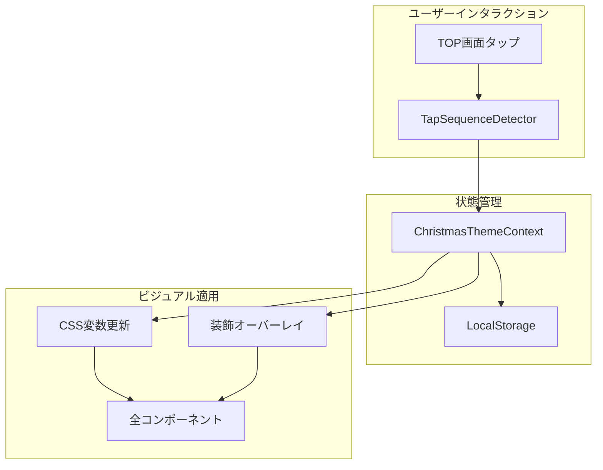

# 設計ドキュメント: クリスマスイースターエッグ

## 概要

本機能は、TOP画面（SongManagement）を短時間に13回タップすることで発動する隠し機能として、アプリ全体のビジュアルをクリスマス仕様に切り替える。React Contextを使用してテーマ状態を管理し、CSS変数を活用してスタイルを動的に変更する。

## アーキテクチャ



## コンポーネントとインターフェース

### 1. ChristmasThemeContext

クリスマスモードの状態を管理するReact Context。

```typescript
interface ChristmasThemeContextValue {
  isChristmasMode: boolean;
  toggleChristmasMode: () => void;
}
```

### 2. useTapSequenceDetector フック

連続タップを検出するカスタムフック。

```typescript
interface TapSequenceConfig {
  requiredTaps: number;      // 必要なタップ回数（13）
  timeWindowMs: number;      // 時間枠（3000ms）
  onSequenceComplete: () => void;
}

function useTapSequenceDetector(config: TapSequenceConfig): {
  handleTap: () => void;
  tapCount: number;
  resetSequence: () => void;
}
```

### 3. ChristmasDecorations コンポーネント

クリスマス装飾を表示するオーバーレイコンポーネント。

```typescript
interface ChristmasDecorationsProps {
  isActive: boolean;
}
```

### 4. christmasTheme ユーティリティ

CSS変数の適用・解除を行うユーティリティ関数。

```typescript
const christmasTheme = {
  apply: () => void;
  remove: () => void;
  isApplied: () => boolean;
}
```

## データモデル

### ローカルストレージキー

```typescript
const CHRISTMAS_MODE_KEY = 'music-bubble-christmas-mode';

interface ChristmasModeStorage {
  isEnabled: boolean;
  lastToggled: string; // ISO日付文字列
}
```

### CSS変数定義

```css
:root {
  /* 通常テーマ */
  --theme-primary: #5A5A5A;
  --theme-background: linear-gradient(135deg, #E8F4FD 0%, #FFF0F5 100%);
  --theme-accent: #FFB6C1;
}

:root.christmas-mode {
  /* クリスマステーマ */
  --theme-primary: #1a472a;
  --theme-background: linear-gradient(135deg, #0f2027 0%, #203a43 50%, #2c5364 100%);
  --theme-accent: #c41e3a;
  --christmas-red: #c41e3a;
  --christmas-green: #1a472a;
  --christmas-gold: #ffd700;
  --christmas-white: #fffafa;
}
```

## 正確性プロパティ

*プロパティとは、システムの全ての有効な実行において真であるべき特性や振る舞いのことです。プロパティは人間が読める仕様と機械で検証可能な正確性保証の橋渡しとなります。*

### Property 1: タップシーケンスによるモード切替

*任意の*タップシーケンスにおいて、時間枠内に13回のタップが発生した場合、クリスマスモードの状態が反転する（有効→無効、または無効→有効）

**Validates: Requirements 1.1, 1.4**

### Property 2: タイムアウトによるカウントリセット

*任意の*タップシーケンスにおいて、時間枠（3秒）が経過した後に新しいタップが発生した場合、タップカウントは1にリセットされる

**Validates: Requirements 1.3**

### Property 3: モード切替のラウンドトリップ

*任意の*初期状態において、クリスマスモードを有効化してから無効化すると、全てのCSS変数が元の値に戻る

**Validates: Requirements 2.4**

### Property 4: ローカルストレージの永続化ラウンドトリップ

*任意の*クリスマスモード状態において、状態をローカルストレージに保存し、その後読み込むと、同じ状態が復元される

**Validates: Requirements 3.1, 3.2, 3.3**

## エラーハンドリング

### ローカルストレージエラー

- ストレージが利用できない場合: メモリ内の状態のみで動作
- 破損したデータ: デフォルト値（無効）にフォールバック

### タップ検出エラー

- 高速連打による過負荷: デバウンス処理で対応
- タッチイベントとクリックイベントの重複: イベント正規化で対応

## テスト戦略

### ユニットテスト

1. `useTapSequenceDetector`フックのテスト
   - 13回タップでコールバック発火
   - タイムアウトでリセット
   - 連続呼び出しの正確なカウント

2. `christmasTheme`ユーティリティのテスト
   - CSS変数の適用確認
   - CSS変数の解除確認

3. ローカルストレージ操作のテスト
   - 保存と読み込みの正確性

### プロパティベーステスト

プロパティベーステストには `fast-check` ライブラリを使用する。

1. **Property 1テスト**: ランダムなタイミングでのタップシーケンスを生成し、13回目で必ずモードが切り替わることを確認
2. **Property 2テスト**: ランダムな遅延を含むタップシーケンスを生成し、タイムアウト後のリセットを確認
3. **Property 3テスト**: モード切替のラウンドトリップでCSS変数が復元されることを確認
4. **Property 4テスト**: ランダムな状態でのストレージ永続化ラウンドトリップを確認

### テスト実行設定

- 各プロパティベーステストは最低100回のイテレーションを実行
- 各テストには対応するプロパティ番号をコメントで明記
