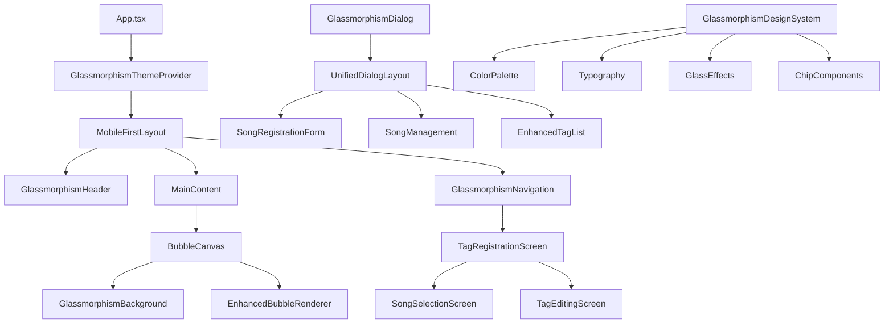

# 設計書

## 概要

この設計書は、音楽シャボン玉エクスプローラーアプリケーションのガラスモーフィズムUIリデザインを定義します。現在のデザインを、透明感のあるモダンなガラスモーフィズム（glassmorphism）デザインに刷新し、専用のタグ登録画面への移行を実装します。既存のアーキテクチャを活用しながら、視覚的な魅力とユーザビリティを大幅に向上させることを目標とします。

## アーキテクチャ

### 現在のアーキテクチャ分析

現在のアプリケーションは以下の構造を持っています：

- **レイアウトシステム**: `MobileFirstLayout`コンポーネントによるレスポンシブレイアウト
- **ナビゲーションシステム**: `MobileFirstNavigation`コンポーネントによるデスクトップ/モバイル対応
- **ダイアログシステム**: `UnifiedDialogLayout`コンポーネントによる統一されたモーダル表示
- **タグ管理システム**: `TagRegistrationDialog`と`TagSelectionView`による現在のダイアログベースのタグ登録
- **データ管理**: `MusicDataService`と`DataManager`による楽曲・タグデータ管理
- **シャボン玉システム**: `BubbleCanvas`と各種マネージャーによる描画・アニメーション

### 改善されたアーキテクチャ



## コンポーネントと インターフェース

### 1. ガラスモーフィズムデザインシステム

#### GlassmorphismThemeProvider コンポーネント
```typescript
interface GlassmorphismTheme {
  colors: {
    primary: string
    secondary: string
    background: string
    surface: string
    glass: string
    accent: string
    text: {
      primary: string
      secondary: string
      onGlass: string
    }
  }
  effects: {
    blur: string
    opacity: string
    border: string
    shadow: string
  }
  typography: {
    fontFamily: string
    fontWeights: {
      light: number
      regular: number
      medium: number
      bold: number
    }
  }
}

interface GlassmorphismThemeProviderProps {
  children: React.ReactNode
  theme?: Partial<GlassmorphismTheme>
}
```

**主要機能:**
- 淡いピンクと白を基調とした配色システム
- ガラスモーフィズム効果の統一管理
- M PLUS Rounded 1cフォントの適用
- レスポンシブ対応のテーマ変数

#### GlassCard コンポーネント
```typescript
interface GlassCardProps {
  children: React.ReactNode
  variant?: 'primary' | 'secondary' | 'accent'
  blur?: 'light' | 'medium' | 'strong'
  opacity?: number
  className?: string
  onClick?: () => void
}
```

**視覚的特徴:**
- `backdrop-filter: blur(10px-20px)`による背景ぼかし
- `background: rgba(255, 255, 255, 0.1-0.3)`による半透明背景
- `border: 1px solid rgba(255, 255, 255, 0.2)`による白い枠線
- `box-shadow: 0 8px 32px rgba(0, 0, 0, 0.1)`による控えめなシャドウ
- `border-radius: 16px-24px`による角丸デザイン

### 2. 専用タグ登録画面システム

#### TagRegistrationScreen コンポーネント
```typescript
interface TagRegistrationScreenProps {
  isVisible: boolean
  onClose: () => void
  onTagsRegistered: (songId: string, tags: string[]) => void
}

interface TagRegistrationScreenState {
  currentStep: 'song-selection' | 'tag-editing'
  selectedSong: Song | null
  navigationHistory: string[]
}
```

**主要機能:**
- ダイアログではなく全画面表示での専用画面
- スムーズな画面遷移アニメーション
- 明確なナビゲーションとパンくずリスト
- モバイルファーストの操作性

#### SongSelectionScreen コンポーネント
```typescript
interface SongSelectionScreenProps {
  songs: Song[]
  onSongSelect: (song: Song) => void
  searchTerm: string
  onSearchChange: (term: string) => void
}
```

**表示特徴:**
- ガラスモーフィズムカードによる楽曲一覧
- 高い視認性を持つリスト表示
- リアルタイム検索とフィルタリング
- タッチ操作に最適化されたインターフェース

#### TagEditingScreen コンポーネント
```typescript
interface TagEditingScreenProps {
  song: Song
  selectedTags: string[]
  availableTags: string[]
  onTagsChange: (tags: string[]) => void
  onSave: () => void
  onCancel: () => void
}
```

**チップ形式タグ編集:**
- 編集時は文字を省略しない完全表示
- インライン編集機能
- ドラッグ&ドロップによる並び替え
- 視覚的なフィードバック

### 3. チップコンポーネントシステム

#### TagChip コンポーネント
```typescript
interface TagChipProps {
  tag: string
  variant?: 'default' | 'selected' | 'editable' | 'removable'
  size?: 'small' | 'medium' | 'large'
  isEditing?: boolean
  onEdit?: (newTag: string) => void
  onRemove?: () => void
  onSelect?: () => void
  maxLength?: number
  showFullText?: boolean
}
```

**視覚的特徴:**
- ガラスモーフィズム効果を適用したチップデザイン
- 編集時は文字省略なしの完全表示
- ホバー・フォーカス状態の視覚的フィードバック
- アニメーション付きの状態変化

#### TagChipGroup コンポーネント
```typescript
interface TagChipGroupProps {
  tags: string[]
  variant?: 'display' | 'editable' | 'selectable'
  onTagEdit?: (index: number, newTag: string) => void
  onTagRemove?: (index: number) => void
  onTagAdd?: (tag: string) => void
  maxTags?: number
  layout?: 'wrap' | 'scroll'
}
```

**レイアウト特徴:**
- フレックスボックスによる自動配置
- レスポンシブ対応の間隔調整
- スクロール可能な横並び表示オプション
- 追加・削除時のスムーズなアニメーション

### 4. 改善されたナビゲーションシステム

#### GlassmorphismNavigation コンポーネント
```typescript
interface GlassmorphismNavigationProps {
  currentView: string
  onViewChange: (view: string) => void
  variant?: 'header' | 'bottom' | 'sidebar'
}
```

**デザイン特徴:**
- ガラスモーフィズム効果を適用したナビゲーションバー
- アクティブ状態の視覚的強調
- スムーズなホバー・タップエフェクト
- アイコンとテキストの最適なバランス

## データモデル

### GlassmorphismTheme データモデル
```typescript
interface GlassmorphismColorPalette {
  // Primary Colors (淡いピンク系)
  primary: {
    50: '#fef7f7'   // 最も薄いピンク
    100: '#fce8e8'  // 薄いピンク
    200: '#f8d1d1'  // 中間ピンク
    300: '#f3b4b4'  // やや濃いピンク
    400: '#ec8b8b'  // 濃いピンク
    500: '#e06666'  // メインピンク
  }
  
  // Neutral Colors (白とグレー系)
  neutral: {
    0: '#ffffff'    // 純白
    50: '#fafafa'   // オフホワイト
    100: '#f5f5f5'  // 薄いグレー
    200: '#e5e5e5'  // 中間グレー
    300: '#d4d4d4'  // やや濃いグレー
    400: '#a3a3a3'  // 濃いグレー
    500: '#737373'  // ダークグレー
  }
  
  // Glass Effects
  glass: {
    light: 'rgba(255, 255, 255, 0.1)'
    medium: 'rgba(255, 255, 255, 0.2)'
    strong: 'rgba(255, 255, 255, 0.3)'
    tinted: 'rgba(254, 247, 247, 0.2)'  // 薄いピンクティント
  }
}

interface GlassmorphismEffects {
  blur: {
    light: 'blur(8px)'
    medium: 'blur(12px)'
    strong: 'blur(20px)'
  }
  
  shadows: {
    subtle: '0 2px 8px rgba(0, 0, 0, 0.05)'
    medium: '0 4px 16px rgba(0, 0, 0, 0.1)'
    strong: '0 8px 32px rgba(0, 0, 0, 0.15)'
    colored: '0 4px 16px rgba(224, 102, 102, 0.1)'  // ピンクティントのシャドウ
  }
  
  borders: {
    glass: '1px solid rgba(255, 255, 255, 0.2)'
    subtle: '1px solid rgba(255, 255, 255, 0.1)'
    accent: '1px solid rgba(224, 102, 102, 0.2)'
  }
}
```

### TagEditingSession データモデル
```typescript
interface TagEditingSession {
  sessionId: string
  songId: string
  originalTags: string[]
  currentTags: string[]
  addedTags: string[]
  removedTags: string[]
  editHistory: TagEditAction[]
  lastModified: Date
  isDirty: boolean
}

interface TagEditAction {
  type: 'add' | 'remove' | 'edit' | 'reorder'
  tag: string
  previousValue?: string
  newValue?: string
  timestamp: Date
  position?: number
}
```

### ScreenTransition データモデル
```typescript
interface ScreenTransitionConfig {
  from: string
  to: string
  animation: 'slide' | 'fade' | 'scale' | 'none'
  duration: number
  easing: string
  direction?: 'left' | 'right' | 'up' | 'down'
}

interface NavigationState {
  currentScreen: string
  previousScreen: string | null
  history: string[]
  canGoBack: boolean
  transitionConfig: ScreenTransitionConfig
}
```

## エラーハンドリング

### ガラスモーフィズム対応エラー表示
```typescript
interface GlassErrorDisplayProps {
  error: Error
  variant?: 'inline' | 'modal' | 'toast'
  onRetry?: () => void
  onDismiss?: () => void
}
```

**視覚的特徴:**
- ガラスモーフィズム効果を適用したエラー表示
- 淡いピンクのアクセントカラー
- 控えめなアニメーション
- アクセシビリティ対応

### タグ編集エラー処理
```typescript
enum TagEditingError {
  TAG_TOO_LONG = 'TAG_TOO_LONG',
  DUPLICATE_TAG = 'DUPLICATE_TAG',
  MAX_TAGS_EXCEEDED = 'MAX_TAGS_EXCEEDED',
  INVALID_CHARACTERS = 'INVALID_CHARACTERS',
  SAVE_FAILED = 'SAVE_FAILED'
}

interface TagEditingErrorHandler {
  handleError(error: TagEditingError, context: any): void
  showInlineError(error: TagEditingError, tagIndex?: number): void
  clearErrors(): void
}
```

## テスト戦略

### 1. ビジュアルリグレッションテスト
- **ガラスモーフィズム効果**: 各ブラウザでの表示確認
- **チップコンポーネント**: 編集状態での文字表示確認
- **画面遷移**: アニメーションの滑らかさ確認
- **レスポンシブデザイン**: 各デバイスサイズでの表示確認

### 2. ユーザビリティテスト
- **タグ編集フロー**: 専用画面での操作性確認
- **チップ編集**: インライン編集の使いやすさ確認
- **画面遷移**: ナビゲーションの直感性確認
- **アクセシビリティ**: キーボード操作とスクリーンリーダー対応

### 3. パフォーマンステスト
- **ガラスモーフィズム効果**: GPU使用率とフレームレート確認
- **大量タグ処理**: 100個のタグでの動作確認
- **画面遷移**: アニメーション中のメモリ使用量確認
- **モバイル性能**: 低スペック端末での動作確認

### 4. ブラウザ互換性テスト
- **backdrop-filter対応**: Safari、Chrome、Firefox、Edgeでの確認
- **CSS Grid/Flexbox**: レイアウトの互換性確認
- **フォント読み込み**: M PLUS Rounded 1cの表示確認
- **タッチ操作**: モバイルブラウザでの操作性確認

## 実装フェーズ

### フェーズ1: ガラスモーフィズムデザインシステム構築
1. GlassmorphismThemeProviderの実装
2. 基本的なGlassCardコンポーネントの作成
3. カラーパレットとエフェクトシステムの構築
4. M PLUS Rounded 1cフォントの統合

### フェーズ2: チップコンポーネントシステム実装
1. TagChipコンポーネントの実装
2. TagChipGroupコンポーネントの実装
3. インライン編集機能の実装
4. アニメーション効果の追加

### フェーズ3: 専用タグ登録画面の実装
1. TagRegistrationScreenコンポーネントの作成
2. SongSelectionScreenの実装
3. TagEditingScreenの実装
4. 画面遷移システムの構築

### フェーズ4: 既存コンポーネントのガラスモーフィズム化
1. ヘッダーとナビゲーションの更新
2. ダイアログシステムの更新
3. シャボン玉キャンバス背景の更新
4. 全体的な統一感の調整

### フェーズ5: 統合・最適化・テスト
1. 全コンポーネントの統合
2. パフォーマンス最適化
3. アクセシビリティ対応
4. ブラウザ互換性確認

## パフォーマンス考慮事項

### 1. ガラスモーフィズム効果の最適化
- `will-change: backdrop-filter`によるGPU加速
- 不要な要素での`backdrop-filter`使用の回避
- レイヤー分離による描画最適化
- モバイルでの効果強度の調整

### 2. チップコンポーネントの最適化
- 仮想化による大量タグの効率的レンダリング
- メモ化による不要な再レンダリング防止
- イベントデリゲーションによるイベントハンドラー最適化
- アニメーション中のパフォーマンス監視

### 3. 画面遷移の最適化
- `transform3d`によるハードウェア加速
- 遷移中の不要な処理の停止
- プリロードによる遷移速度向上
- メモリリークの防止

## セキュリティ考慮事項

### 1. タグ入力の検証
- XSS攻撃防止のための入力サニタイゼーション
- タグ長制限の強制
- 特殊文字の適切な処理
- CSP（Content Security Policy）の設定

### 2. データ整合性
- タグデータの整合性検証
- 同期処理中のデータ競合防止
- エラー時のデータ復旧機能
- バックアップとロールバック機能

## アクセシビリティ対応

### 1. キーボードナビゲーション
- タブ順序の論理的な設定
- フォーカス表示の明確化
- ショートカットキーの提供
- スクリーンリーダー対応

### 2. 色彩とコントラスト
- WCAG 2.1 AA基準の遵守
- 色だけに依存しない情報伝達
- ハイコントラストモード対応
- カラーブラインド対応

### 3. 音声読み上げ対応
- 適切なARIAラベルの設定
- ライブリージョンによる動的更新通知
- 構造化されたヘッディング
- 代替テキストの提供

## 互換性とブラウザサポート

### サポート対象
- **デスクトップ**: Chrome 88+, Firefox 87+, Safari 14+, Edge 88+
- **モバイル**: iOS Safari 14+, Chrome Mobile 88+, Samsung Internet 15+
- **タブレット**: iPad Safari 14+, Android Chrome 88+

### フォールバック戦略
- `backdrop-filter`未対応時の代替スタイル
- CSS Grid未対応時のFlexboxフォールバック
- フォント未読み込み時のシステムフォント使用
- JavaScript無効時の基本機能提供

### プログレッシブエンハンスメント
- 基本機能の確実な動作
- 高機能ブラウザでの拡張機能
- 段階的な機能向上
- 優雅な機能劣化