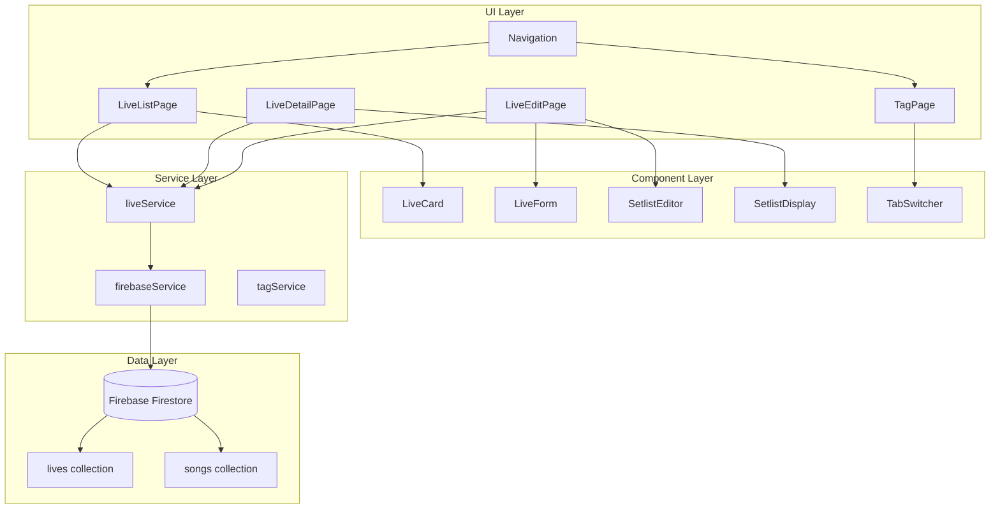
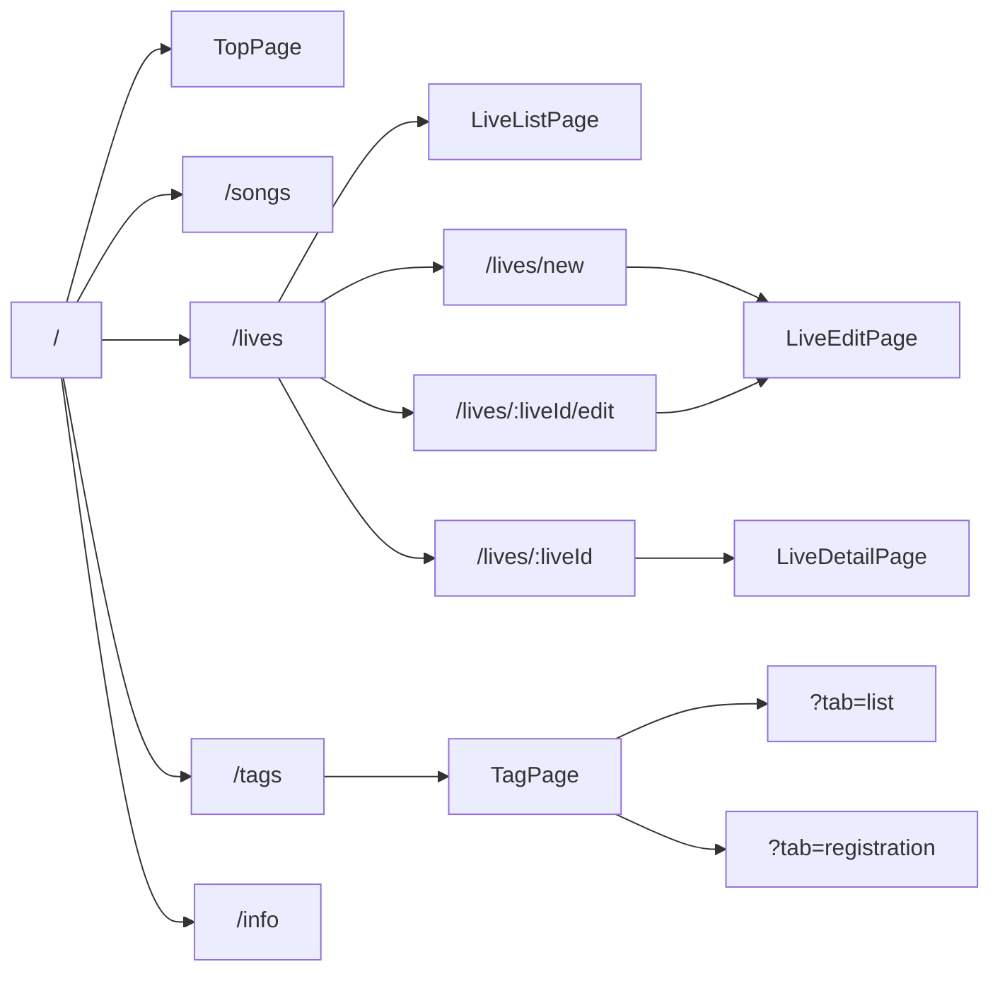

# 設計ドキュメント

## 概要

本ドキュメントは、Music Bubble Explorer V2にライブ情報管理機能を追加するための技術設計を定義する。この機能は、ライブ公演情報（ツアー、単独公演、フェス）の登録・編集・閲覧を可能にし、セトリ管理と日替わり曲の表示をサポートする。また、ナビゲーションの改善としてタグページの統合も行う。

## アーキテクチャ

### 全体構成



### ルーティング構造



## コンポーネントとインターフェース

### 新規ページコンポーネント

#### LiveListPage
ライブ一覧を表示するページコンポーネント。

```typescript
interface LiveListPageProps {
  // propsなし（ルートコンポーネント）
}

// 内部状態
interface LiveListPageState {
  lives: Live[]
  isLoading: boolean
  error: string | null
}
```

#### LiveDetailPage
ライブ詳細を表示するページコンポーネント。

```typescript
interface LiveDetailPageProps {
  // propsなし（useParamsでliveIdを取得）
}

// 内部状態
interface LiveDetailPageState {
  live: Live | null
  isLoading: boolean
  error: string | null
}
```

#### LiveEditPage
ライブの登録・編集を行うページコンポーネント。

```typescript
interface LiveEditPageProps {
  // propsなし（useParamsでliveIdを取得、新規の場合はundefined）
}

// 内部状態
interface LiveEditPageState {
  live: Live | null
  songs: Song[]
  isLoading: boolean
  isSaving: boolean
  error: string | null
  validationErrors: Record<string, string>
}
```

#### TagPage（統合タグページ）
タグ一覧とタグ登録を統合したページコンポーネント。

```typescript
interface TagPageProps {
  // propsなし（useSearchParamsでtabを取得）
}

type TabType = 'list' | 'registration'

// 内部状態
interface TagPageState {
  activeTab: TabType
}
```

### 新規UIコンポーネント

#### LiveCard
ライブ一覧の各項目を表示するカードコンポーネント。

```typescript
interface LiveCardProps {
  live: Live
  onClick: (liveId: string) => void
}
```

#### LiveForm
ライブ情報の入力フォームコンポーネント。

```typescript
interface LiveFormProps {
  live?: Live
  onSubmit: (liveData: LiveFormData) => void
  onCancel: () => void
  isLoading?: boolean
  validationErrors?: Record<string, string>
}

interface LiveFormData {
  liveType: LiveType
  title: string
  venueName: string
  dateTime: string
  tourLocation?: string
  setlist: SetlistItemFormData[]
}
```

#### SetlistEditor
セトリの編集コンポーネント。

```typescript
interface SetlistEditorProps {
  items: SetlistItemFormData[]
  songs: Song[]
  onChange: (items: SetlistItemFormData[]) => void
  disabled?: boolean
}

interface SetlistItemFormData {
  songId?: string
  songTitle: string
  isDailySong: boolean
}
```

#### SetlistDisplay
セトリの表示コンポーネント。

```typescript
interface SetlistDisplayProps {
  items: SetlistItem[]
  songs: Song[]
  onSongClick?: (songId: string) => void
}
```

#### TabSwitcher
タブ切り替えコンポーネント。

```typescript
interface TabSwitcherProps {
  tabs: TabItem[]
  activeTab: string
  onTabChange: (tabId: string) => void
}

interface TabItem {
  id: string
  label: string
}
```

### サービス層

#### liveService
ライブデータのCRUD操作を管理するサービス。

```typescript
interface LiveService {
  // ライブ一覧を取得
  getAllLives(): Promise<Live[]>
  
  // ライブ詳細を取得
  getLiveById(liveId: string): Promise<Live | null>
  
  // ライブを作成
  createLive(liveData: CreateLiveData): Promise<string>
  
  // ライブを更新
  updateLive(liveId: string, liveData: UpdateLiveData): Promise<void>
  
  // ライブを削除
  deleteLive(liveId: string): Promise<void>
  
  // リアルタイム監視
  subscribeToLives(callback: (lives: Live[]) => void): () => void
}

interface CreateLiveData {
  liveType: LiveType
  title: string
  venueName: string
  dateTime: string
  tourLocation?: string
  setlist: SetlistItem[]
}

type UpdateLiveData = Partial<CreateLiveData>
```

## データモデル

### Live（ライブ）

```typescript
/**
 * ライブ種別
 */
type LiveType = 'tour' | 'solo' | 'festival'

/**
 * ライブ種別の表示名マッピング
 */
const LIVE_TYPE_LABELS: Record<LiveType, string> = {
  tour: 'ツアー',
  solo: '単独公演',
  festival: 'フェス'
}

/**
 * セトリ項目
 */
interface SetlistItem {
  /** 楽曲ID（既存楽曲の場合） */
  songId?: string
  /** 楽曲名（フリー入力または既存楽曲から取得） */
  songTitle: string
  /** 演奏順序（1から開始） */
  order: number
  /** 日替わり曲フラグ */
  isDailySong: boolean
}

/**
 * ライブデータ
 */
interface Live {
  /** ライブID */
  id: string
  /** ライブ種別 */
  liveType: LiveType
  /** 公演名 */
  title: string
  /** 会場名 */
  venueName: string
  /** 日時（ISO 8601形式） */
  dateTime: string
  /** 公演地（ツアーの場合のみ） */
  tourLocation?: string
  /** セトリ */
  setlist: SetlistItem[]
  /** 作成日時 */
  createdAt?: string
  /** 更新日時 */
  updatedAt?: string
}
```

### Firestore構造

```
firestore/
├── songs/           # 既存の楽曲コレクション
│   └── {songId}/
│       ├── title
│       ├── artists
│       ├── tags
│       └── ...
│
└── lives/           # 新規ライブコレクション
    └── {liveId}/
        ├── liveType: "tour" | "solo" | "festival"
        ├── title: string
        ├── venueName: string
        ├── dateTime: Timestamp
        ├── tourLocation?: string
        ├── setlist: SetlistItem[]
        ├── createdAt: Timestamp
        └── updatedAt: Timestamp
```

### ナビゲーション更新

```typescript
// 更新後のナビゲーションアイテム
const navItems: NavItem[] = [
  { path: '/', label: 'TOP', icon: <TopIcon /> },
  { path: '/songs', label: '楽曲', icon: <MusicIcon /> },
  { path: '/lives', label: 'ライブ', icon: <LiveIcon /> },
  { path: '/tags', label: 'タグ', icon: <TagIcon /> },
  { path: '/info', label: 'お知らせ', icon: <InfoIcon /> },
]
```


## 正確性プロパティ

*プロパティとは、システムの有効な実行すべてにおいて真であるべき特性または動作のことです。プロパティは、人間が読める仕様と機械で検証可能な正確性保証の橋渡しをします。*

### Property 1: タブ状態とURLパラメータの同期

*任意の*タブ状態に対して、URLパラメータ`tab`の値はアクティブなタブIDと一致すること。タブを切り替えた場合、URLパラメータも同期して更新されること。

**検証対象: 要件 2.4**

### Property 2: ライブ種別の有効値検証

*任意の*ライブデータに対して、`liveType`フィールドは「tour」「solo」「festival」のいずれかの値のみを持つこと。無効な値が設定された場合、バリデーションエラーが発生すること。

**検証対象: 要件 3.2**

### Property 3: 日替わり曲フラグの動作

*任意の*セトリ項目に対して、`isDailySong`フラグがtrueの場合、そのセトリ項目は日替わり曲として識別されること。フラグの切り替えは即座に状態に反映されること。

**検証対象: 要件 3.6, 7.5**

### Property 4: ライブ一覧の表示内容検証

*任意の*ライブリストに対して、表示されるライブカードの数は取得したライブの数と一致すること。各ライブカードはライブ種別、公演名、会場名、日時を含むこと。

**検証対象: 要件 4.1, 4.2**

### Property 5: ライブのソート順

*任意の*ライブリストに対して、デフォルトのソート順は日時の降順（新しい順）であること。リスト内の各ライブの日時は、前のライブの日時以下であること。

**検証対象: 要件 4.4**

### Property 6: セトリの順序表示

*任意の*セトリに対して、表示される楽曲の順序は`order`フィールドの昇順と一致すること。セトリ項目の追加・削除・並び替え後も、順序の整合性が保たれること。

**検証対象: 要件 3.4, 5.2, 7.4**

### Property 7: 日替わり曲インジケーター表示

*任意の*セトリ表示に対して、`isDailySong`がtrueのセトリ項目には視覚的インジケーターが表示されること。`isDailySong`がfalseの項目にはインジケーターが表示されないこと。

**検証対象: 要件 5.3**

### Property 8: ツアー公演地の条件付き表示

*任意の*ライブデータに対して、`liveType`が「tour」かつ`tourLocation`が設定されている場合のみ、公演地フィールドが表示されること。`liveType`が「tour」以外の場合、公演地入力フィールドは非表示であること。

**検証対象: 要件 3.3, 5.4, 6.3**

### Property 9: ライブ種別変更時の公演地クリア

*任意の*ライブ編集操作に対して、`liveType`を「tour」から他の種別に変更した場合、`tourLocation`フィールドは自動的にクリアされること。

**検証対象: 要件 7.3**

### Property 10: ライブデータのラウンドトリップ

*任意の*有効なライブデータに対して、保存後に取得したデータは元のデータと等価であること（id、createdAt、updatedAtを除く）。更新操作後も同様に、更新内容が正しく反映されること。

**検証対象: 要件 6.8, 7.6**

### Property 11: バリデーションエラー表示

*任意の*無効なフォーム入力に対して、必須フィールド（公演名、会場名、日時）が空の場合、対応するバリデーションエラーメッセージが表示されること。

**検証対象: 要件 6.9**

### Property 12: ライブ削除後の取得不可

*任意の*削除されたライブに対して、削除後にそのライブIDで取得を試みた場合、nullまたはエラーが返されること。削除されたライブは一覧にも表示されないこと。

**検証対象: 要件 8.2**

### Property 13: 編集フォームの事前入力

*任意の*既存ライブの編集ページに対して、フォームの各フィールドは既存のライブデータで事前入力されること。セトリも含めてすべてのデータが正しく反映されること。

**検証対象: 要件 7.1**

## エラーハンドリング

### ネットワークエラー

| エラー種別 | 発生条件 | 対応 |
|-----------|---------|------|
| 接続エラー | Firebase接続失敗 | エラーメッセージ表示、リトライボタン提供 |
| タイムアウト | 5秒以上応答なし | タイムアウトメッセージ表示、リトライ可能 |
| オフライン | ネットワーク切断 | オフラインインジケーター表示、キャッシュデータ使用 |

### データエラー

| エラー種別 | 発生条件 | 対応 |
|-----------|---------|------|
| 取得エラー | ライブデータ取得失敗 | エラーメッセージ表示、リトライボタン提供 |
| 保存エラー | ライブ保存失敗 | エラーメッセージ表示、入力データ保持 |
| 削除エラー | ライブ削除失敗 | エラーメッセージ表示、現在のページ維持 |
| 存在しないライブ | 指定IDのライブが存在しない | 「ライブが見つかりません」メッセージ、一覧へのリンク |

### バリデーションエラー

| フィールド | バリデーション | エラーメッセージ |
|-----------|---------------|-----------------|
| 公演名 | 必須、空文字不可 | 「公演名を入力してください」 |
| 会場名 | 必須、空文字不可 | 「会場名を入力してください」 |
| 日時 | 必須、有効な日時形式 | 「日時を選択してください」 |
| ライブ種別 | 必須、有効な値 | 「ライブ種別を選択してください」 |
| セトリ楽曲名 | 空文字不可 | 「楽曲名を入力してください」 |

## テスト戦略

### テストアプローチ

本機能では、ユニットテストとプロパティベーステストの両方を使用して包括的なテストカバレッジを実現する。

- **ユニットテスト**: 特定の例、エッジケース、エラー条件の検証
- **プロパティテスト**: 任意の入力に対する普遍的なプロパティの検証

### プロパティベーステスト設定

- **ライブラリ**: fast-check（TypeScript/JavaScript用）
- **最小反復回数**: 各プロパティテストで100回以上
- **タグ形式**: `Feature: live-management, Property {number}: {property_text}`

### テスト対象コンポーネント

#### サービス層テスト

| テスト対象 | テスト種別 | 内容 |
|-----------|-----------|------|
| liveService.getAllLives | ユニット | 空リスト、複数ライブの取得 |
| liveService.getLiveById | ユニット | 存在するID、存在しないID |
| liveService.createLive | プロパティ | ラウンドトリップ検証（Property 10） |
| liveService.updateLive | プロパティ | ラウンドトリップ検証（Property 10） |
| liveService.deleteLive | プロパティ | 削除後の取得不可検証（Property 12） |
| sortLivesByDate | プロパティ | ソート順検証（Property 5） |

#### コンポーネント層テスト

| テスト対象 | テスト種別 | 内容 |
|-----------|-----------|------|
| LiveCard | プロパティ | 表示内容検証（Property 4） |
| SetlistDisplay | プロパティ | 順序表示検証（Property 6）、日替わり曲表示（Property 7） |
| SetlistEditor | プロパティ | 順序変更の整合性（Property 6） |
| LiveForm | プロパティ | バリデーション検証（Property 11）、事前入力検証（Property 13） |
| TabSwitcher | プロパティ | URL同期検証（Property 2.4） |

#### 統合テスト

| テスト対象 | 内容 |
|-----------|------|
| ライブ登録フロー | フォーム入力→保存→一覧表示の一連の流れ |
| ライブ編集フロー | 詳細表示→編集→保存→詳細表示の一連の流れ |
| ライブ削除フロー | 詳細表示→削除確認→削除→一覧表示の一連の流れ |
| タブ切り替え | タブ切り替え→URL更新→ブラウザバック→タブ状態復元 |

### エッジケーステスト

- 空のセトリでのライブ登録
- 100曲以上のセトリ
- 特殊文字を含む公演名・会場名
- 同一日時の複数ライブ
- 過去日時のライブ登録
- 未来日時のライブ登録
