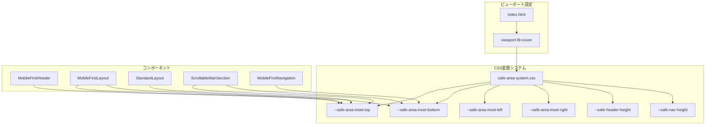

# 設計ドキュメント

## 概要

本設計は、iOS/Androidの各種ブラウザにおけるセーフエリア問題を根本的に解決するためのものである。特に、ノッチやURLバーによってヘッダーが隠れてしまう問題に対応し、どのデバイス・ブラウザでも一貫したユーザー体験を提供する。

### 設計方針

1. **CSS-first アプローチ**: JavaScriptに依存せず、CSSのenv()関数とCSS変数を最大限活用
2. **プログレッシブエンハンスメント**: 古いブラウザでも動作するフォールバックを提供
3. **集中管理**: セーフエリア関連のCSS変数を一箇所で定義し、全コンポーネントで再利用
4. **パフォーマンス重視**: 不要なJavaScript計算を避け、CSSネイティブ機能を活用

## アーキテクチャ



## コンポーネントとインターフェース

### 1. safe-area-system.css（新規作成）

セーフエリア関連のCSS変数を集中管理する新しいCSSファイル。

```css
/* セーフエリアCSS変数システム */
:root {
  /* セーフエリアインセット（env()のラッパー） */
  --safe-area-inset-top: env(safe-area-inset-top, 0px);
  --safe-area-inset-bottom: env(safe-area-inset-bottom, 0px);
  --safe-area-inset-left: env(safe-area-inset-left, 0px);
  --safe-area-inset-right: env(safe-area-inset-right, 0px);
  
  /* フォールバック付きセーフエリア（モバイル用） */
  --safe-area-top-fallback: max(env(safe-area-inset-top, 0px), 20px);
  --safe-area-bottom-fallback: max(env(safe-area-inset-bottom, 0px), 0px);
  
  /* ヘッダー高さ（セーフエリア込み） */
  --safe-header-height-mobile: calc(65px + var(--safe-area-inset-top));
  --safe-header-height-desktop: 95px;
  
  /* ナビゲーション高さ（セーフエリア込み） */
  --safe-nav-height: calc(60px + var(--safe-area-inset-bottom));
}
```

### 2. MobileFirstHeader.tsx（修正）

ヘッダーコンポーネントにセーフエリア対応を追加。

主な変更点:
- `padding-top`にセーフエリアインセットを適用
- `min-height`にセーフエリアを含めた計算
- フォールバック値の追加

### 3. MobileFirstLayout.tsx（修正）

レイアウトコンポーネントのセーフエリア対応を強化。

主な変更点:
- コンテナの`padding-top`にセーフエリアを適用
- dvh単位の使用とvhフォールバック

### 4. ScrollableMainSection.tsx（修正）

スクロール領域のセーフエリア対応。

主な変更点:
- ヘッダーラッパーの高さ計算にセーフエリアを含める
- コンテンツ領域の位置調整

### 5. StandardLayout.css（修正）

モーダル/オーバーレイのセーフエリア対応。

主な変更点:
- 統合ヘッダーの`padding-top`にセーフエリアを適用
- コンテンツラッパーの位置調整

### 6. index.html（確認・修正）

ビューポート設定の確認。

```html
<meta name="viewport" content="width=device-width, initial-scale=1.0, viewport-fit=cover" />
```

## データモデル

本機能はデータモデルの変更を必要としない。CSS変数とスタイルの変更のみで実装する。

## 正確性プロパティ

*プロパティとは、システムのすべての有効な実行において真であるべき特性や動作のことです。プロパティは、人間が読める仕様と機械で検証可能な正確性保証の橋渡しとなります。*

### プロパティ1: ヘッダーパディングの最小値保証

*任意の*モバイルデバイスにおいて、ヘッダーコンポーネントのpadding-topは、env(safe-area-inset-top)の値以上であること。env()がサポートされていない場合は、最小20pxのフォールバック値が適用されること。

**検証: 要件 1.1, 1.4**

### プロパティ2: ヘッダー位置の可視性保証

*任意の*ブラウザ環境において、ヘッダーコンポーネントのコンテンツ（ボタン等）のtop位置は、ビューポートの上端からsafe-area-inset-top以上離れていること。

**検証: 要件 1.2, 4.1, 4.2**

### プロパティ3: スクロール時のヘッダー位置維持

*任意の*スクロール操作後において、ヘッダーコンポーネントのビューポートに対する相対位置は変化しないこと（固定ヘッダーの場合）。

**検証: 要件 1.3**

### プロパティ4: モーダルヘッダーのセーフエリア適用

*任意の*フルスクリーンモーダルまたはオーバーレイにおいて、ヘッダー部分のpadding-topにはsafe-area-inset-topが適用されていること。

**検証: 要件 2.1, 2.2**

### プロパティ5: ナビゲーションのセーフエリア適用

*任意の*モバイルデバイスにおいて、下部ナビゲーションのpadding-bottomにはenv(safe-area-inset-bottom)が適用されていること。

**検証: 要件 3.3**

### プロパティ6: ビューポート高さ単位のフォールバック

*任意の*ブラウザにおいて、フルスクリーン高さの計算にはdvh単位が使用され、dvhがサポートされていない場合はvh単位にフォールバックすること。

**検証: 要件 3.2, 5.3**

### プロパティ7: env()非サポート時のフォールバック

*任意の*env()をサポートしないブラウザにおいて、セーフエリア関連のスタイルは適切なフォールバック値（0pxまたは指定されたデフォルト値）を使用すること。

**検証: 要件 6.2**

## エラーハンドリング

### CSS env()非サポート時

```css
/* フォールバックパターン */
.header {
  /* フォールバック値（env非サポートブラウザ用） */
  padding-top: 20px;
  /* env()サポートブラウザ用 */
  padding-top: max(env(safe-area-inset-top, 0px), 20px);
}
```

### dvh非サポート時

```css
.container {
  /* フォールバック値（dvh非サポートブラウザ用） */
  min-height: 100vh;
  /* dvhサポートブラウザ用 */
  min-height: 100dvh;
}
```

### @supportsによる機能検出

```css
@supports (padding-top: env(safe-area-inset-top)) {
  .header {
    padding-top: env(safe-area-inset-top, 0px);
  }
}

@supports not (padding-top: env(safe-area-inset-top)) {
  .header {
    padding-top: 20px;
  }
}
```

## テスト戦略

### デュアルテストアプローチ

本機能では、ユニットテストとプロパティベーステストの両方を使用する。

### ユニットテスト

- CSS変数が正しく定義されていることの確認
- viewport metaタグの設定確認
- コンポーネントのスタイル適用確認

### プロパティベーステスト

プロパティベーステストには**fast-check**ライブラリを使用する。

テスト対象:
1. ヘッダーパディングの最小値保証（プロパティ1）
2. モーダルヘッダーのセーフエリア適用（プロパティ4）
3. ナビゲーションのセーフエリア適用（プロパティ5）
4. フォールバック値の適用（プロパティ7）

各プロパティベーステストは最低100回のイテレーションで実行する。

### 実機テスト（手動）

以下の環境での手動テストを実施:
- iOS Safari（ノッチ付きiPhone）
- iOS Chrome（ノッチ付きiPhone）
- Android Chrome（URLバー上部タイプ）
- デスクトップブラウザ（Chrome、Safari、Firefox）

### 開発モードでの視覚的デバッグ

開発モードでは、セーフエリア境界を視覚的に表示するデバッグ機能を提供:

```css
/* 開発モード用セーフエリア可視化 */
.debug-safe-area::before {
  content: '';
  position: fixed;
  top: 0;
  left: 0;
  right: 0;
  height: env(safe-area-inset-top, 0px);
  background: rgba(255, 0, 0, 0.2);
  pointer-events: none;
  z-index: 99999;
}
```

