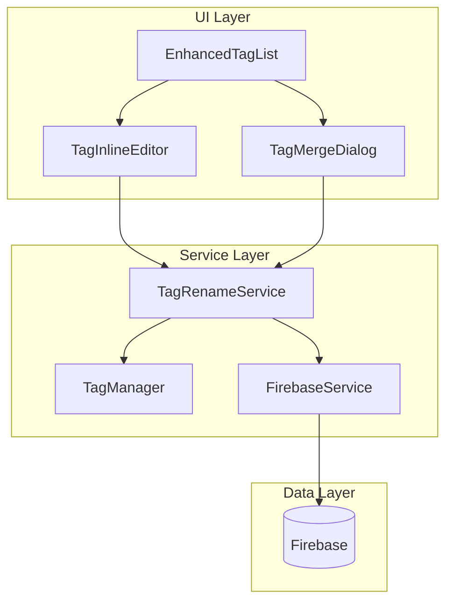

# 設計ドキュメント

## 概要

タグ一覧画面（EnhancedTagList）にタグ名称変更機能を追加する。ユーザーはタグ項目の編集ボタンをクリックしてインライン編集でタグ名を変更できる。変更後のタグ名が既存のタグ名と重複する場合は、確認ダイアログを表示し、ユーザーの承認後に2つのタグを統合（マージ）する。

## アーキテクチャ



### データフロー

1. ユーザーが編集ボタンをクリック → EnhancedTagListがTagInlineEditorを表示
2. ユーザーが新しいタグ名を入力して送信
3. TagRenameServiceが既存タグとの重複をチェック
4. 重複がない場合 → タグ名を更新してFirebaseに保存
5. 重複がある場合 → TagMergeDialogを表示
6. ユーザーが統合を確認 → タグを統合してFirebaseに保存

## コンポーネントとインターフェース

### TagInlineEditor コンポーネント

タグ項目内でインライン編集を提供するコンポーネント。

```typescript
interface TagInlineEditorProps {
  tagName: string
  isEditing: boolean
  onSave: (newName: string) => void
  onCancel: () => void
  isLoading?: boolean
  error?: string | null
}
```

### TagMergeDialog コンポーネント

タグ統合の確認ダイアログ。既存のConfirmDialogを拡張して使用。

```typescript
interface TagMergeDialogProps {
  isOpen: boolean
  sourceTag: string
  targetTag: string
  sourceSongCount: number
  targetSongCount: number
  onConfirm: () => void
  onCancel: () => void
  isLoading?: boolean
}
```

### TagRenameService サービス

タグ名称変更と統合のビジネスロジックを管理。

```typescript
interface TagRenameResult {
  success: boolean
  error?: string
  mergeRequired?: boolean
  targetTag?: string
}

interface TagMergeResult {
  success: boolean
  error?: string
  affectedSongCount: number
}

class TagRenameService {
  // タグ名の検証
  validateTagName(name: string): { valid: boolean; error?: string }
  
  // タグ名称変更（重複チェック含む）
  renameTag(oldName: string, newName: string): Promise<TagRenameResult>
  
  // タグ統合
  mergeTags(sourceTag: string, targetTag: string): Promise<TagMergeResult>
  
  // 既存タグとの重複チェック
  checkDuplicate(tagName: string): boolean
}
```

### useTagRename フック

タグ名称変更のUI状態管理を行うカスタムフック。

```typescript
interface UseTagRenameReturn {
  // 編集状態
  editingTagId: string | null
  editingValue: string
  
  // 統合ダイアログ状態
  mergeDialogOpen: boolean
  mergeSourceTag: string | null
  mergeTargetTag: string | null
  
  // 操作状態
  isLoading: boolean
  error: string | null
  successMessage: string | null
  
  // アクション
  startEditing: (tagId: string, tagName: string) => void
  cancelEditing: () => void
  submitRename: (newName: string) => Promise<void>
  confirmMerge: () => Promise<void>
  cancelMerge: () => void
}
```

## データモデル

### 既存のTagインターフェース（変更なし）

```typescript
interface Tag {
  id: string
  name: string
  songs: string[] // song IDs
}
```

### 楽曲のタグ更新

タグ名称変更時は、関連するすべての楽曲の`tags`配列を更新する必要がある。

```typescript
// 楽曲のタグ配列内のタグ名を更新
interface Song {
  // ...既存フィールド
  tags?: string[]
}
```

## 正確性プロパティ

*プロパティとは、システムのすべての有効な実行において真であるべき特性や動作のことです。プロパティは、人間が読める仕様と機械で検証可能な正確性保証の橋渡しとして機能します。*

### Property 1: タグ名称変更のラウンドトリップ
*任意の*有効なタグ名と新しいタグ名（既存タグと重複しない）に対して、名称変更を実行した後にFirebaseから再取得すると、新しいタグ名で楽曲が取得でき、元のタグ名では楽曲が取得できない
**Validates: Requirements 1.2, 1.5**

### Property 2: 空白タグ名の拒否
*任意の*空白文字のみで構成された文字列（空文字、スペース、タブ、改行など）に対して、タグ名として送信すると、変更は拒否されエラーが返される
**Validates: Requirements 1.3**

### Property 3: キャンセル操作の状態保持
*任意の*タグと編集状態に対して、キャンセル操作を実行すると、タグの状態は編集前と完全に一致する
**Validates: Requirements 1.4, 2.5**

### Property 4: タグ統合の完全性
*任意の*2つのタグ（統合元と統合先）に対して、統合を実行すると、統合元タグに紐づいていたすべての楽曲が統合先タグに含まれ、統合元タグは削除される
**Validates: Requirements 2.3, 2.4**

### Property 5: タグ統合のラウンドトリップ
*任意の*2つのタグに対して、統合を実行した後にFirebaseから再取得すると、統合先タグのみが存在し、統合元タグの楽曲がすべて含まれている
**Validates: Requirements 2.6**

## エラーハンドリング

### バリデーションエラー

| エラー条件 | エラーメッセージ |
|-----------|-----------------|
| 空のタグ名 | 「タグ名を入力してください」 |
| 空白のみのタグ名 | 「タグ名を入力してください」 |
| 元のタグ名と同じ | 変更なしで編集を終了（エラーなし） |

### 操作エラー

| エラー条件 | エラーメッセージ |
|-----------|-----------------|
| Firebase接続エラー | 「保存に失敗しました。ネットワーク接続を確認してください」 |
| タグが見つからない | 「タグが見つかりません。画面を更新してください」 |
| 楽曲更新エラー | 「一部の楽曲の更新に失敗しました」 |

### エラー回復

- Firebase接続エラー時は再試行ボタンを表示
- 部分的な更新失敗時はロールバックを試行
- ロールバック失敗時はユーザーに手動での確認を促す

## テスト戦略

### プロパティベーステスト

プロパティベーステストには **fast-check** ライブラリを使用する。

各正確性プロパティに対して、以下の形式でテストを実装する：

```typescript
import fc from 'fast-check'

// Property 1: タグ名称変更のラウンドトリップ
// **Feature: tag-rename-and-merge, Property 1: タグ名称変更のラウンドトリップ**
test('タグ名称変更後にFirebaseから再取得すると新しいタグ名で楽曲が取得できる', async () => {
  await fc.assert(
    fc.asyncProperty(
      validTagNameArb,
      newTagNameArb,
      async (oldName, newName) => {
        // 前提条件: newNameは既存タグと重複しない
        fc.pre(!existingTags.includes(newName))
        
        // 操作: タグ名を変更
        await tagRenameService.renameTag(oldName, newName)
        
        // 検証: 新しいタグ名で楽曲が取得できる
        const songs = await firebaseService.getSongsByTag(newName)
        expect(songs.length).toBeGreaterThan(0)
        
        // 検証: 元のタグ名では楽曲が取得できない
        const oldSongs = await firebaseService.getSongsByTag(oldName)
        expect(oldSongs.length).toBe(0)
      }
    ),
    { numRuns: 100 }
  )
})
```

### ユニットテスト

- TagRenameService.validateTagName: 各種入力パターンのバリデーション
- TagRenameService.checkDuplicate: 重複チェックロジック
- TagInlineEditor: 編集状態の遷移
- TagMergeDialog: ダイアログの表示内容

### 統合テスト

- EnhancedTagList + TagInlineEditor: インライン編集フロー
- TagRenameService + FirebaseService: 永続化フロー
- 完全な名称変更フロー（UI → Service → Firebase → UI更新）
- 完全な統合フロー（UI → Dialog → Service → Firebase → UI更新）
