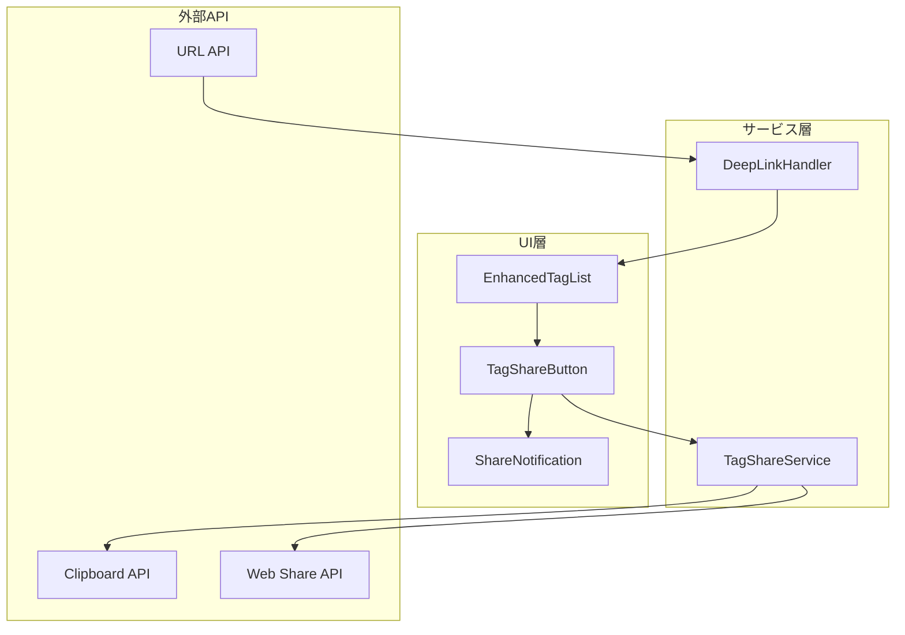

# 設計書

## 概要

タグ一覧画面からX（旧Twitter）への共有機能を実装する。この機能は以下の2つの主要コンポーネントで構成される：

1. **共有テキスト生成・コピー機能**: タグ名、説明文、ディープリンクを含むX投稿用テキストを生成し、クリップボードにコピーする
2. **ディープリンク処理機能**: URLパラメータからタグ情報を読み取り、該当タグの詳細画面を自動的に表示する

## アーキテクチャ



## コンポーネントとインターフェース

### TagShareService

共有テキストの生成とクリップボード操作を担当するサービス。

```typescript
// src/services/tagShareService.ts

export interface ShareTextOptions {
  tagName: string
  baseUrl?: string
}

export interface ShareResult {
  success: boolean
  message: string
  shareText?: string
}

export class TagShareService {
  private static instance: TagShareService | null = null
  
  static getInstance(): TagShareService
  
  /**
   * 共有用テキストを生成する
   * Requirements: 2.1, 2.2, 2.3, 2.4, 2.5
   */
  generateShareText(options: ShareTextOptions): string
  
  /**
   * ディープリンクURLを生成する
   * Requirements: 5.1, 5.2, 5.3
   */
  generateDeepLink(tagName: string, baseUrl?: string): string
  
  /**
   * タグ名をURLエンコードする
   * Requirements: 2.5, 5.3
   */
  encodeTagName(tagName: string): string
  
  /**
   * URLエンコードされたタグ名をデコードする
   * Requirements: 4.4, 5.3
   */
  decodeTagName(encodedTagName: string): string
  
  /**
   * テキストをクリップボードにコピーする
   * Requirements: 3.1, 3.3
   */
  copyToClipboard(text: string): Promise<ShareResult>
  
  /**
   * Web Share APIを使用して共有する（モバイル向け）
   * Requirements: 6.1
   */
  shareNative(text: string, url: string): Promise<ShareResult>
  
  /**
   * Web Share APIが利用可能かチェックする
   */
  isNativeShareAvailable(): boolean
}
```

### DeepLinkHandler

URLパラメータからタグ情報を解析し、適切な画面遷移を行うハンドラー。

```typescript
// src/utils/deepLinkHandler.ts

export interface DeepLinkResult {
  hasTagParam: boolean
  tagName: string | null
  isValid: boolean
  errorMessage?: string
}

/**
 * URLからタグパラメータを解析する
 * Requirements: 4.1, 4.4
 */
export function parseTagFromUrl(url?: string): DeepLinkResult

/**
 * タグが存在するかチェックする
 * Requirements: 4.3
 */
export function validateTagExists(tagName: string, availableTags: string[]): boolean

/**
 * ディープリンクの初期化処理
 * Requirements: 4.2, 4.5
 */
export function initializeDeepLink(
  onTagFound: (tagName: string) => void,
  onError: (message: string) => void,
  availableTags: string[]
): void
```

### TagShareButton コンポーネント

タグアイテムに表示される共有ボタン。

```typescript
// src/components/TagShareButton.tsx

export interface TagShareButtonProps {
  tagName: string
  onShareSuccess?: () => void
  onShareError?: (error: string) => void
}

/**
 * タグ共有ボタンコンポーネント
 * Requirements: 1.1, 1.2, 1.3
 */
export const TagShareButton: React.FC<TagShareButtonProps>
```

## データモデル

### 共有テキストフォーマット

```
みな実さんの楽曲を「#${tagName}」で探してみよう！🎵

${deepLinkUrl}

#栗林みな実 #マロバブ
```

### URLパラメータフォーマット

```
https://example.com/?tag=${encodeURIComponent(tagName)}
```

例：
- タグ名: `ロック` → URL: `https://example.com/?tag=%E3%83%AD%E3%83%83%E3%82%AF`
- タグ名: `アニメOP` → URL: `https://example.com/?tag=%E3%82%A2%E3%83%8B%E3%83%A1OP`

## 正確性プロパティ

*正確性プロパティとは、システムのすべての有効な実行において真であるべき特性や振る舞いのことです。プロパティは人間が読める仕様と機械で検証可能な正確性保証の橋渡しとなります。*

### Property 1: 共有テキストにハッシュタグ付きタグ名が含まれる

*任意の*タグ名に対して、生成された共有テキストには `#${tagName}` 形式のハッシュタグ付きタグ名が含まれる

**検証対象: 要件 2.1**

### Property 2: 共有テキストに有効なディープリンクURLが含まれる

*任意の*タグ名に対して、生成された共有テキストには `?tag=` パラメータを含む有効なURL形式のディープリンクが含まれる

**検証対象: 要件 2.2, 5.1**

### Property 3: 共有テキストの長さが280文字以下

*任意の*タグ名（長いタグ名を含む）に対して、生成された共有テキストの長さは280文字以下である

**検証対象: 要件 2.4**

### Property 4: タグ名のエンコード/デコードのラウンドトリップ一貫性

*任意の*有効なタグ名に対して、`decodeTagName(encodeTagName(tagName))` は元のタグ名と等しい

**検証対象: 要件 2.5, 4.4, 5.3, 5.4**

### Property 5: URLパラメータからタグ名が正しく解析される

*任意の*有効なタグパラメータを含むURLに対して、`parseTagFromUrl` は正しいタグ名を返す

**検証対象: 要件 4.1**

## エラーハンドリング

### クリップボードAPIエラー

```typescript
// クリップボードAPIが利用できない場合
if (!navigator.clipboard) {
  return {
    success: false,
    message: 'クリップボードAPIが利用できません。テキストを手動でコピーしてください。',
    shareText: generatedText
  }
}

// コピー失敗時
try {
  await navigator.clipboard.writeText(text)
} catch (error) {
  return {
    success: false,
    message: 'コピーに失敗しました。テキストを手動でコピーしてください。',
    shareText: text
  }
}
```

### ディープリンクエラー

```typescript
// タグが見つからない場合
if (!validateTagExists(tagName, availableTags)) {
  onError('タグが見つかりませんでした')
  return
}

// URLパラメータが無効な場合
if (!result.isValid) {
  onError(result.errorMessage || 'URLパラメータが無効です')
  return
}
```

## テスト戦略

### ユニットテスト

- `TagShareService.generateShareText`: 各種タグ名での共有テキスト生成
- `TagShareService.encodeTagName` / `decodeTagName`: 特殊文字のエンコード/デコード
- `parseTagFromUrl`: 各種URLパラメータの解析
- `validateTagExists`: タグ存在チェック

### プロパティベーステスト

プロパティベーステストは、ランダムに生成された多数の入力に対してプロパティが成り立つことを検証します。

- **Property 1**: ランダムなタグ名で共有テキストを生成し、ハッシュタグ付きタグ名が含まれることを確認
- **Property 2**: ランダムなタグ名で共有テキストを生成し、有効なURL形式のリンクが含まれることを確認
- **Property 3**: ランダムな長さのタグ名で共有テキストを生成し、280文字以下であることを確認
- **Property 4**: ランダムなタグ名でエンコード→デコードのラウンドトリップを確認
- **Property 5**: ランダムなタグパラメータを含むURLを生成し、正しく解析されることを確認

テストフレームワーク: `fast-check` (TypeScript用プロパティベーステストライブラリ)

各プロパティテストは最低100回のイテレーションを実行します。

### 統合テスト

- EnhancedTagListコンポーネントでの共有ボタン表示
- 共有ボタンクリック時のクリップボードコピー
- ディープリンクからのタグ詳細画面表示
- エラー時のフォールバック動作
