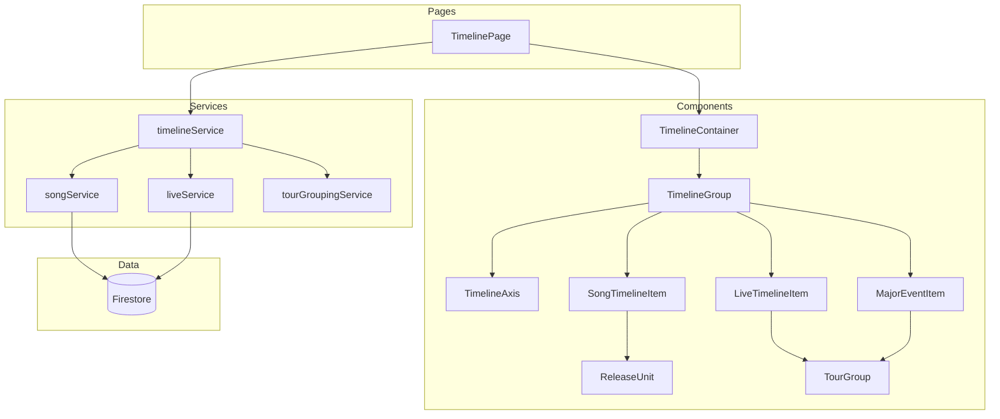

# Design Document: Timeline Page

## Overview

タイムラインページは、楽曲とライブパフォーマンスを時系列で可視化する新しいページ機能です。中央の垂直タイムライン軸を持つスクロール可能なレイアウトで、楽曲を右側に、ライブイベントを左側に配置し、重要イベント（単独公演・ツアー）を中央に表示します。

### 設計方針

1. **既存機能の再利用**: 既存の`tourGroupingService`、データ取得サービス、コンポーネントを最大限活用
2. **レイヤー分離**: データ変換ロジックをサービス層に、UI表示をコンポーネント層に分離
3. **段階的レンダリング**: 大量データに対応するため、仮想スクロールまたは遅延読み込みを考慮
4. **将来の拡張性**: 公開時にナビゲーションメニューへの追加が容易な設計

## Architecture




## Components and Interfaces

### 1. TimelineItem 型定義

```typescript
/**
 * タイムラインアイテムの種別
 */
type TimelineItemType = 'song' | 'live' | 'release-unit' | 'tour-group' | 'major-event'

/**
 * タイムラインアイテムの配置
 */
type TimelineItemPosition = 'left' | 'right' | 'center'

/**
 * 基本タイムラインアイテム
 */
interface BaseTimelineItem {
  /** 一意識別子 */
  id: string
  /** アイテム種別 */
  type: TimelineItemType
  /** タイムライン上の配置 */
  position: TimelineItemPosition
  /** 代表日時（ISO 8601形式） */
  date: string
  /** 年月グループキー（YYYY-MM形式） */
  yearMonth: string
}

/**
 * 楽曲タイムラインアイテム
 */
interface SongTimelineItem extends BaseTimelineItem {
  type: 'song'
  position: 'right'
  song: Song
}

/**
 * リリース単位タイムラインアイテム
 * 同じsingleName/albumNameを持つ楽曲のグループ
 */
interface ReleaseUnitTimelineItem extends BaseTimelineItem {
  type: 'release-unit'
  position: 'right'
  releaseName: string
  releaseType: 'single' | 'album'
  songs: Song[]
  /** 展開状態 */
  isExpanded?: boolean
}

/**
 * ライブイベントタイムラインアイテム
 */
interface LiveTimelineItem extends BaseTimelineItem {
  type: 'live'
  position: 'left'
  live: Live
}

/**
 * ツアーグループタイムラインアイテム
 */
interface TourGroupTimelineItem extends BaseTimelineItem {
  type: 'tour-group'
  position: 'left'
  tourGroup: TourGroup
  /** 展開状態 */
  isExpanded?: boolean
}

/**
 * 重要イベントタイムラインアイテム
 * 単独公演またはツアーグループ
 */
interface MajorEventTimelineItem extends BaseTimelineItem {
  type: 'major-event'
  position: 'center'
  eventType: 'solo' | 'tour'
  /** 単独公演データ（eventType='solo'の場合） */
  live?: Live
  /** ツアーグループデータ（eventType='tour'の場合） */
  tourGroup?: TourGroup
  /** 展開状態 */
  isExpanded?: boolean
}

/**
 * タイムラインアイテムのユニオン型
 */
type TimelineItem = 
  | SongTimelineItem 
  | ReleaseUnitTimelineItem 
  | LiveTimelineItem 
  | TourGroupTimelineItem 
  | MajorEventTimelineItem

/**
 * 年月グループ
 */
interface TimelineYearMonthGroup {
  /** 年月キー（YYYY-MM形式） */
  yearMonth: string
  /** グループ内のアイテムリスト */
  items: TimelineItem[]
}
```

### 2. timelineService

```typescript
/**
 * タイムラインデータ変換サービス
 * 楽曲とライブデータをタイムラインアイテムに変換し、グループ化する
 */
class TimelineService {
  constructor(
    private songService: SongService,
    private liveService: LiveService,
    private tourGroupingService: TourGroupingService
  ) {}

  /**
   * タイムラインデータを取得・変換
   * @returns 年月グループの配列（時系列順）
   */
  async fetchTimelineData(): Promise<TimelineYearMonthGroup[]>

  /**
   * 楽曲をタイムラインアイテムに変換
   * - singleNameでグループ化
   * - albumNameでグループ化（singleNameがない場合）
   * - どちらもない場合は個別アイテム
   */
  private convertSongsToTimelineItems(songs: Song[]): TimelineItem[]

  /**
   * ライブをタイムラインアイテムに変換
   * - liveType='tour'は既存のtourGroupingServiceでグループ化
   * - liveType='solo'または'tour'は重要イベント（center）として扱う
   * - その他は左側の通常ライブアイテム
   */
  private convertLivesToTimelineItems(lives: Live[]): TimelineItem[]

  /**
   * タイムラインアイテムを年月でグループ化
   * @param items タイムラインアイテムの配列
   * @param sortOrder ソート順（'asc' | 'desc'、デフォルト: 'desc'）
   */
  private groupByYearMonth(
    items: TimelineItem[], 
    sortOrder?: 'asc' | 'desc'
  ): TimelineYearMonthGroup[]

  /**
   * 日付文字列から年月キー（YYYY-MM）を抽出
   * - releaseYear + releaseDate (MMDD) → YYYY-MM
   * - ISO 8601 dateTime → YYYY-MM
   */
  private extractYearMonth(date: string | { year?: number; date?: string }): string

  /**
   * 楽曲をリリース単位でグループ化
   * @param songs 楽曲の配列
   * @returns リリース単位とグループ化されない個別楽曲
   */
  private groupSongsByRelease(songs: Song[]): {
    releaseUnits: Map<string, Song[]>
    standalonesSongs: Song[]
  }
}
```

### 3. TimelinePage コンポーネント

```typescript
/**
 * TimelinePage コンポーネント
 * タイムラインページのルートコンポーネント
 * 
 * URL: /timeline
 */
function TimelinePage(): JSX.Element {
  // データフェッチ
  const { data, loading, error } = useTimelineData()
  
  // ソート順の状態管理
  const [sortOrder, setSortOrder] = useState<'asc' | 'desc'>('desc')
  
  // レンダリング
  return (
    <div className="timeline-page">
      <Header title="タイムライン" />
      <TimelineControls sortOrder={sortOrder} onSortChange={setSortOrder} />
      {loading && <LoadingSpinner />}
      {error && <ErrorMessage error={error} />}
      {data && <TimelineContainer groups={data} />}
    </div>
  )
}
```

### 4. TimelineContainer コンポーネント

```typescript
interface TimelineContainerProps {
  /** 年月グループの配列 */
  groups: TimelineYearMonthGroup[]
}

/**
 * TimelineContainer コンポーネント
 * タイムライン全体のコンテナ
 * スクロール可能な領域を提供
 */
function TimelineContainer({ groups }: TimelineContainerProps): JSX.Element
```

### 5. TimelineGroup コンポーネント

```typescript
interface TimelineGroupProps {
  /** 年月グループデータ */
  group: TimelineYearMonthGroup
}

/**
 * TimelineGroup コンポーネント
 * 1つの年月グループを表示
 * - 年月ヘッダー
 * - タイムライン軸
 * - 左側のライブアイテム
 * - 右側の楽曲アイテム
 * - 中央の重要イベント
 */
function TimelineGroup({ group }: TimelineGroupProps): JSX.Element
```

### 6. TimelineAxis コンポーネント

```typescript
/**
 * TimelineAxis コンポーネント
 * 中央の垂直タイムライン軸を表示
 */
function TimelineAxis(): JSX.Element
```

### 7. SongTimelineItem / ReleaseUnit コンポーネント

```typescript
interface SongTimelineItemProps {
  /** 楽曲データ */
  song: Song
  /** クリック時のコールバック */
  onClick?: (songId: string) => void
}

/**
 * SongTimelineItem コンポーネント
 * 個別楽曲をタイムラインアイテムとして表示
 */
function SongTimelineItem({ song, onClick }: SongTimelineItemProps): JSX.Element

interface ReleaseUnitProps {
  /** リリース単位データ */
  releaseUnit: ReleaseUnitTimelineItem
  /** 展開/折りたたみコールバック */
  onToggle?: () => void
  /** 楽曲クリック時のコールバック */
  onSongClick?: (songId: string) => void
}

/**
 * ReleaseUnit コンポーネント
 * リリース単位（シングル/アルバム）をタイムラインアイテムとして表示
 * - ヘッダー: リリース名、収録曲数
 * - 展開時: 収録楽曲リスト、埋め込みコンテンツ
 */
function ReleaseUnit({ releaseUnit, onToggle, onSongClick }: ReleaseUnitProps): JSX.Element
```

### 8. LiveTimelineItem / TourGroupItem コンポーネント

```typescript
interface LiveTimelineItemProps {
  /** ライブデータ */
  live: Live
  /** クリック時のコールバック */
  onClick?: (liveId: string) => void
}

/**
 * LiveTimelineItem コンポーネント
 * 個別ライブイベントをタイムラインアイテムとして表示
 */
function LiveTimelineItem({ live, onClick }: LiveTimelineItemProps): JSX.Element

interface TourGroupItemProps {
  /** ツアーグループデータ */
  tourGroup: TourGroup
  /** 展開/折りたたみコールバック */
  onToggle?: () => void
  /** クリック時のコールバック */
  onClick?: (tourName: string) => void
}

/**
 * TourGroupItem コンポーネント
 * ツアーグループをタイムラインアイテムとして表示
 * 既存のTourCardを流用または参考にする
 */
function TourGroupItem({ tourGroup, onToggle, onClick }: TourGroupItemProps): JSX.Element
```

### 9. MajorEventItem コンポーネント

```typescript
interface MajorEventItemProps {
  /** 重要イベントデータ */
  event: MajorEventTimelineItem
  /** 展開/折りたたみコールバック */
  onToggle?: () => void
  /** クリック時のコールバック */
  onClick?: (id: string) => void
}

/**
 * MajorEventItem コンポーネント
 * 重要イベント（単独公演・ツアー）を中央に表示
 * - タイムライン軸の両側にまたがるレイアウト
 * - 目立つスタイリング（大きめのカード、強調色）
 */
function MajorEventItem({ event, onToggle, onClick }: MajorEventItemProps): JSX.Element
```

## Data Models

### タイムラインデータ変換フロー

```
1. データ取得
   songService.fetchAllSongs() → Song[]
   liveService.fetchAllLives() → Live[]

2. 楽曲の変換・グループ化
   groupSongsByRelease(songs) → {
     releaseUnits: Map<releaseName, Song[]>,
     standaloneSongs: Song[]
   }
   
   → SongTimelineItem[] + ReleaseUnitTimelineItem[]

3. ライブの変換・グループ化
   tourGroupingService.groupLives(lives) → GroupedLiveItem[]
   
   → LiveTimelineItem[] + TourGroupTimelineItem[] + MajorEventTimelineItem[]

4. 統合とソート
   [...songItems, ...liveItems] → TimelineItem[]
   
5. 年月グループ化
   groupByYearMonth(items) → TimelineYearMonthGroup[]
```

### アルゴリズム詳細

#### 1. 楽曲のリリース単位グループ化アルゴリズム

```typescript
function groupSongsByRelease(songs: Song[]): {
  releaseUnits: Map<string, Song[]>
  standaloneSongs: Song[]
} {
  const singleMap = new Map<string, Song[]>()
  const albumMap = new Map<string, Song[]>()
  const standaloneSongs: Song[] = []

  for (const song of songs) {
    if (song.singleName) {
      // シングル名でグループ化
      const key = song.singleName
      if (!singleMap.has(key)) {
        singleMap.set(key, [])
      }
      singleMap.get(key)!.push(song)
    } else if (song.albumName) {
      // アルバム名でグループ化
      const key = song.albumName
      if (!albumMap.has(key)) {
        albumMap.set(key, [])
      }
      albumMap.get(key)!.push(song)
    } else {
      // グループ化なし
      standaloneSongs.push(song)
    }
  }

  // シングルとアルバムをマージ
  const releaseUnits = new Map([...singleMap, ...albumMap])
  
  return { releaseUnits, standaloneSongs }
}
```

#### 2. 年月キー抽出アルゴリズム

```typescript
function extractYearMonth(dateInput: string | { year?: number; date?: string }): string {
  if (typeof dateInput === 'string') {
    // ISO 8601形式の場合
    const date = new Date(dateInput)
    const year = date.getFullYear()
    const month = String(date.getMonth() + 1).padStart(2, '0')
    return `${year}-${month}`
  } else {
    // Song型の場合（releaseYear + releaseDate）
    const { year, date } = dateInput
    if (!year || !date) {
      return '9999-99' // 日付不明の場合
    }
    const month = date.substring(0, 2)
    return `${year}-${month}`
  }
}
```

#### 3. 年月グループ化とソートアルゴリズム

```typescript
function groupByYearMonth(
  items: TimelineItem[], 
  sortOrder: 'asc' | 'desc' = 'desc'
): TimelineYearMonthGroup[] {
  // 年月でグループ化
  const groupMap = new Map<string, TimelineItem[]>()
  
  for (const item of items) {
    const { yearMonth } = item
    if (!groupMap.has(yearMonth)) {
      groupMap.set(yearMonth, [])
    }
    groupMap.get(yearMonth)!.push(item)
  }

  // グループを配列に変換
  const groups: TimelineYearMonthGroup[] = Array.from(groupMap.entries()).map(
    ([yearMonth, items]) => ({
      yearMonth,
      items: items.sort((a, b) => {
        // グループ内は日付の昇順
        return a.date.localeCompare(b.date)
      })
    })
  )

  // グループを年月でソート
  groups.sort((a, b) => {
    const comparison = a.yearMonth.localeCompare(b.yearMonth)
    return sortOrder === 'desc' ? -comparison : comparison
  })

  return groups
}
```

## Correctness Properties

*A property is a characteristic or behavior that should hold true across all valid executions of a system-essentially, a formal statement about what the system should do. Properties serve as the bridge between human-readable specifications and machine-verifiable correctness guarantees.*

### Acceptance Criteria Testing Prework

このセクションでは、各受入基準がプロパティベーステストに適しているかを分析します。

### Property Reflection

プロパティベーステストに適した受入基準を確認した結果、以下のプロパティが特定されました。冗長性を排除するため、以下の統合を行います:

**統合1**: 1.2と7.1は同じ要件（年月グループ化）のため、統合します
**統合2**: 2.1と2.2は同じパターン（Major_Event変換）のため、1つのプロパティに統合します
**統合3**: 4.1と4.2は楽曲グループ化の異なるケースですが、1つの包括的プロパティに統合できます

最終的に、以下の独立したプロパティが残ります:
- 年月グループ化の正しさ（1.2/7.1統合）
- タイムラインアイテムのソート順（1.5）
- Major_Event変換の正しさ（2.1/2.2統合）
- ツアーグループの統合（3.1、既存プロパティ）
- ツアーグループの年月決定（3.4）
- 楽曲のリリース単位グループ化（4.1/4.2統合）
- 未グループ化楽曲の扱い（4.3）
- 年月キー抽出の正しさ（4.5）
- 同一年月アイテムのグループ化（7.3）
- 年月グループのソート順（7.4）

### Correctness Properties

### Property 1: Timeline items are grouped by year-month

*For any* list of TimelineItem objects, when grouped by year-month, all items with the same yearMonth value SHALL be placed in the same TimelineYearMonthGroup, and no items with different yearMonth values SHALL be in the same group.

**Validates: Requirements 1.2, 7.1, 7.3**

### Property 2: Timeline items are sorted chronologically

*For any* list of TimelineItem objects within a TimelineYearMonthGroup, when sorted, the items SHALL be ordered by their date field in ascending order (oldest first).

**Validates: Requirements 1.5**

### Property 3: Year-month groups are sorted chronologically

*For any* list of TimelineYearMonthGroup objects, when sorted, the groups SHALL be ordered by their yearMonth field in the specified order (ascending or descending).

**Validates: Requirements 7.4**

### Property 4: Major events are created for solo and tour lives

*For any* Live object with liveType='solo' or liveType='tour', when converted to timeline items, the system SHALL create a MajorEventTimelineItem with position='center'.

**Validates: Requirements 2.1, 2.2**

### Property 5: Tour groups use earliest performance date for year-month

*For any* TourGroup with multiple performances, the yearMonth field SHALL equal the year-month extracted from the earliest performance's dateTime.

**Validates: Requirements 3.4**

### Property 6: Songs are grouped by release name

*For any* list of Song objects, when grouped by release, all songs with the same singleName SHALL be in the same ReleaseUnitTimelineItem, all songs with the same albumName (and no singleName) SHALL be in the same ReleaseUnitTimelineItem, and songs with neither SHALL be individual SongTimelineItem objects.

**Validates: Requirements 4.1, 4.2, 4.3**

### Property 7: Year-month extraction is correct

*For any* valid date input (ISO 8601 string or {releaseYear, releaseDate} object), the extracted yearMonth SHALL be in YYYY-MM format and SHALL match the year and month of the input date.

**Validates: Requirements 4.5**

### Property 8: Release unit embeds include all songs' content

*For any* ReleaseUnitTimelineItem, the displayed embedded content SHALL include all musicServiceEmbeds from all songs in the release unit.

**Validates: Requirements 5.3**

## Error Handling

### データ取得エラー

| エラー状況 | 対応 |
|-----------|------|
| 楽曲データ取得失敗 | ErrorMessage表示、リトライボタン提供 |
| ライブデータ取得失敗 | ErrorMessage表示、リトライボタン提供 |
| 両方の取得失敗 | 統合エラーメッセージ、リトライボタン提供 |

### データ欠損処理

| 欠損状況 | 対応 |
|---------|------|
| 楽曲のreleaseYear/releaseDateが欠損 | yearMonth='9999-99'として最後に配置 |
| ライブのdateTimeが欠損 | yearMonth='9999-99'として最後に配置 |
| 埋め込みデータが無効 | エラーログを出力し、埋め込みをスキップ |

### ルーティングエラー

| エラー状況 | 対応 |
|-----------|------|
| /timelineへの直接アクセス失敗 | エラーページ表示、ホームへのリンク提供 |

## Testing Strategy

### Dual Testing Approach

タイムラインページの機能は、ユニットテストとプロパティベーステストの組み合わせでテストします。

**ユニットテスト**: 特定の例、エッジケース、エラー条件を検証
**プロパティテスト**: ランダムな入力に対する普遍的性質を検証

### Property-Based Testing Library

**fast-check** (TypeScript/JavaScript用プロパティベーステストライブラリ)

### Property-Based Tests

各プロパティテストは最低100回のイテレーションで実行します。

1. **Property 1テスト**: 年月グループ化の正しさ
   - ランダムなTimelineItemリストを生成
   - groupByYearMonth関数を実行
   - 同じyearMonthのアイテムが同じグループにあることを確認
   - Tag: **Feature: timeline-page, Property 1: Timeline items are grouped by year-month**

2. **Property 2テスト**: アイテム内ソート順の正しさ
   - ランダムなTimelineItemリストを生成
   - グループ内のアイテムが日付昇順であることを確認
   - Tag: **Feature: timeline-page, Property 2: Timeline items are sorted chronologically**

3. **Property 3テスト**: グループソート順の正しさ
   - ランダムなTimelineYearMonthGroupリストを生成
   - 指定したソート順でグループが並んでいることを確認
   - Tag: **Feature: timeline-page, Property 3: Year-month groups are sorted chronologically**

4. **Property 4テスト**: Major_Event変換の正しさ
   - ランダムなLive（solo/tour）を生成
   - MajorEventTimelineItemに変換されることを確認
   - position='center'であることを確認
   - Tag: **Feature: timeline-page, Property 4: Major events are created for solo and tour lives**

5. **Property 5テスト**: ツアーグループ年月決定の正しさ
   - ランダムなTourGroupを生成（複数の異なる日付の公演）
   - yearMonthが最も早い公演の年月と一致することを確認
   - Tag: **Feature: timeline-page, Property 5: Tour groups use earliest performance date for year-month**

6. **Property 6テスト**: 楽曲のリリース単位グループ化の正しさ
   - ランダムなSongリストを生成（singleName/albumName/なしの組み合わせ）
   - groupSongsByRelease関数を実行
   - 同じsingleName/albumNameの楽曲が同じリリース単位にグループ化されることを確認
   - どちらもない楽曲が個別アイテムになることを確認
   - Tag: **Feature: timeline-page, Property 6: Songs are grouped by release name**

7. **Property 7テスト**: 年月抽出の正しさ
   - ランダムな日付入力を生成（ISO 8601文字列と{releaseYear, releaseDate}オブジェクト）
   - extractYearMonth関数を実行
   - 結果がYYYY-MM形式であることを確認
   - 元の日付の年月と一致することを確認
   - Tag: **Feature: timeline-page, Property 7: Year-month extraction is correct**

8. **Property 8テスト**: リリース単位埋め込みコンテンツの完全性
   - ランダムなReleaseUnitTimelineItemを生成（各楽曲が異なる埋め込みを持つ）
   - 表示される埋め込みコンテンツが全楽曲の埋め込みを含むことを確認
   - Tag: **Feature: timeline-page, Property 8: Release unit embeds include all songs' content**

### Unit Tests

- **timelineService.groupSongsByRelease**: 特定のシングル/アルバム名でのグループ化を確認
- **timelineService.extractYearMonth**: 境界値ケース（1月、12月、うるう年）を確認
- **timelineService.convertLivesToTimelineItems**: 各liveTypeの変換を確認
- **TimelinePage**: データ読み込み中、エラー時の表示を確認
- **ReleaseUnit**: 展開/折りたたみ動作を確認
- **MajorEventItem**: 単独公演とツアーの表示を確認

### Integration Tests

- **ルーティング**: /timelineへの直接アクセスでページが表示されることを確認
- **データフェッチ**: 実際のFirestoreからのデータ取得とタイムライン表示を確認
- **ナビゲーション**: タイムラインアイテムクリックで詳細ページへ遷移することを確認
- **展開機能**: ツアーグループとリリース単位の展開/折りたたみが動作することを確認
- **レスポンシブ**: モバイルサイズでのレイアウト表示を確認

### Smoke Tests

- **UIレンダリング**: タイムライン軸、アイテム、年月ヘッダーが表示されることを確認
- **スタイリング**: 既存デザインシステムのCSSクラスが適用されていることを確認
- **アクセス制限**: ナビゲーションメニューにタイムラインリンクがないことを確認

## UI/UX Layout Specifications

### レイアウト構造

```
┌─────────────────────────────────────────┐
│           Header (タイトル)              │
├─────────────────────────────────────────┤
│      Sort Controls (新/古切り替え)       │
├─────────────────────────────────────────┤
│                                         │
│  ┌──────────── YYYY-MM ────────────┐   │
│  │                                  │   │
│  │  Left Side    │ Axis │ Right    │   │
│  │  (Lives)      │  │   │ (Songs)  │   │
│  │               │  │   │          │   │
│  │  ┌─────┐     │  ●   │  ┌─────┐ │   │
│  │  │Live │─────┼──┘   │  │Song │ │   │
│  │  └─────┘     │      │  └─────┘ │   │
│  │               │  ●───┼──┘      │   │
│  │               │  │   │  ┌─────┐│   │
│  │  ┌─────┐     │  │   │  │Song ││   │
│  │  │Tour │─────┼──●   │  └─────┘│   │
│  │  └─────┘     │  │   │          │   │
│  │               │      │          │   │
│  │    ┌──────────────────────┐    │   │
│  │    │   Major Event (Solo) │    │   │
│  │    │      (Centered)      │    │   │
│  │    └──────────────────────┘    │   │
│  │                                  │   │
│  └──────────────────────────────────┘   │
│                                         │
│  ┌──────────── YYYY-MM ────────────┐   │
│  │  ...                             │   │
│  └──────────────────────────────────┘   │
│                                         │
└─────────────────────────────────────────┘
```

### レスポンシブデザイン

#### デスクトップ (768px以上)

- 3カラムレイアウト (左:ライブ | 中央:軸 | 右:楽曲)
- タイムライン軸の幅: 2px
- 左右の余白: 各40px
- アイテム幅: 最大400px

#### モバイル (767px以下)

- 単一カラムレイアウト (垂直スタック)
- タイムライン軸を左端に配置
- アイテムを軸の右側に縦並び
- 左右の余白: 各16px
- アイテム幅: 画面幅 - 余白

### コンポーネントスタイリング

#### TimelineAxis (タイムライン軸)

- 背景色: `var(--color-border)`
- 幅: 2px (デスクトップ)
- 幅: 1px (モバイル)
- 高さ: 100%

#### 年月ヘッダー

- フォントサイズ: 1.2rem
- フォントウェイト: bold
- 色: `var(--color-text-primary)`
- 背景色: `var(--color-background)`
- パディング: 16px 0

#### タイムラインアイテム (共通)

- ボーダー: 1px solid `var(--color-border)`
- ボーダー半径: 8px
- パディング: 16px
- マージン: 16px 0
- 背景色: `var(--color-card-background)`
- ホバー時: box-shadow追加

#### タイムライン接続ドット

- サイズ: 12px × 12px
- 形状: 円形
- 背景色: `var(--color-primary)`
- ボーダー: 2px solid `var(--color-background)`

#### Major Event (重要イベント)

- 幅: 左右にまたがる (デスクトップ: 最大800px)
- ボーダー: 2px solid `var(--color-primary)`
- 背景色: `var(--color-primary-light)` (10%透明度)
- フォントサイズ: 1.1rem
- フォントウェイト: 600
- パディング: 24px
- マージン: 24px 0

#### ReleaseUnit / TourGroup (展開可能)

- ヘッダー部分にカーソルをポインターに変更
- 展開ボタン: 右端にアイコン (▼/▲)
- 展開時: アニメーション (0.3秒)
- 楽曲リスト: インデント 16px

### インタラクティブ要素

#### クリック可能アイテム

- カーソル: pointer
- ホバー時: 背景色を若干明るく、box-shadowを追加
- アクティブ時: スケール 0.98

#### 展開/折りたたみボタン

- トランジション: transform 0.3s ease
- 展開時: アイコン回転 180度

### アクセシビリティ

- タブキーでのフォーカス順序: 上から下、左から右
- ARIA属性: `role="article"` (各タイムラインアイテム)
- ARIA属性: `aria-expanded` (展開可能アイテム)
- キーボード操作: Enter/Spaceで展開/折りたたみ

## Implementation Approach

### フェーズ1: データレイヤー構築

1. **TimelineService実装**
   - groupSongsByRelease関数
   - convertSongsToTimelineItems関数
   - convertLivesToTimelineItems関数
   - extractYearMonth関数
   - groupByYearMonth関数
   - fetchTimelineData関数

2. **型定義追加**
   - src/types/index.tsにTimelineItem関連の型を追加

### フェーズ2: UIコンポーネント構築

1. **基本コンポーネント**
   - TimelineAxis (タイムライン軸)
   - TimelineYearMonthHeader (年月ヘッダー)
   - TimelineDot (接続ドット)

2. **アイテムコンポーネント**
   - SongTimelineItem (個別楽曲)
   - ReleaseUnit (リリース単位、展開可能)
   - LiveTimelineItem (個別ライブ)
   - TourGroupItem (ツアーグループ、展開可能)
   - MajorEventItem (重要イベント、展開可能)

3. **コンテナコンポーネント**
   - TimelineGroup (1つの年月グループ)
   - TimelineContainer (全体のコンテナ)

### フェーズ3: ページ構築

1. **TimelinePage実装**
   - useTimelineDataカスタムフック
   - ソート順切り替え機能
   - ローディング・エラー表示
   - データ表示

2. **ルーティング設定**
   - src/router.tsxに/timelineルートを追加

3. **スタイリング**
   - TimelinePage.css
   - TimelineContainer.css
   - TimelineItem.css (各アイテム用の共通スタイル)

### フェーズ4: インタラクティブ機能

1. **ナビゲーション**
   - アイテムクリック → 詳細ページ遷移
   - 既存のuseNavigateフックを使用

2. **展開/折りたたみ**
   - ReleaseUnit: useState for isExpanded
   - TourGroupItem: useState for isExpanded
   - MajorEventItem: useState for isExpanded

### フェーズ5: テスト実装

1. **プロパティベーステスト**
   - fast-checkのインストール
   - 各プロパティに対応するテストの作成
   - 最低100回のイテレーション設定

2. **ユニットテスト**
   - timelineServiceの各関数テスト
   - コンポーネントの動作テスト

3. **統合テスト**
   - ページレベルのE2Eテスト

### フェーズ6: 最適化と洗練

1. **パフォーマンス最適化**
   - 大量データ対応（仮想スクロールまたは遅延読み込み）
   - メモ化（useMemo, React.memo）
   - 不要な再レンダリング防止

2. **アクセシビリティ改善**
   - ARIA属性の追加
   - キーボードナビゲーション対応
   - フォーカス管理

3. **レスポンシブデザイン最終調整**
   - 各画面サイズでの表示確認
   - モバイルでのタッチ操作最適化

## Dependencies and Constraints

### 既存機能への依存

- **tourGroupingService**: ツアーのグループ化ロジックを再利用
- **songService**: 楽曲データ取得
- **liveService**: ライブデータ取得
- **既存コンポーネント**: Header, LoadingSpinner, ErrorMessageを再利用

### 技術的制約

- **React Router**: 既存のルーティング設定に追加
- **既存デザインシステム**: CSS変数と既存スタイルに準拠
- **Firestore**: データ構造は変更せず、クライアント側で変換

### 将来の拡張性

- **ナビゲーション追加**: 公開時にNavigationコンポーネントにリンクを追加するだけ
- **フィルタリング**: 既存のsongSearchServiceを参考に、タイムラインアイテムのフィルタリング機能を追加可能
- **ソート順の保存**: localStorageまたはユーザー設定で保存可能
- **エクスポート機能**: タイムラインデータのPDF/画像エクスポート機能を追加可能

## Open Questions and Decisions

### 決定事項

1. **年月グループの表示順序**: デフォルトは降順（新しい順）、ユーザーが切り替え可能
2. **日付欠損の扱い**: yearMonth='9999-99'として最後に配置
3. **重要イベントの定義**: liveType='solo'または'tour'のみ
4. **リリース単位の優先順位**: singleName > albumName > 個別楽曲
5. **ツアーグループ化**: 既存のtourGroupingServiceを再利用

### 検討事項

1. **大量データの扱い**
   - 現状: 全データを一度に読み込み
   - 検討: 仮想スクロールまたは年単位の遅延読み込み
   - 決定: 初期実装は全読み込み、パフォーマンス問題があれば後で最適化

2. **埋め込みコンテンツの読み込みタイミング**
   - 現状: ページ読み込み時に全て表示
   - 検討: 遅延読み込み（Intersection Observer）
   - 決定: 初期実装は全表示、必要に応じて遅延読み込みを追加

3. **展開状態の永続化**
   - 現状: ページリロードで初期状態に戻る
   - 検討: localStorageで状態を保存
   - 決定: 初期実装は永続化なし、ユーザーフィードバックにより判断

## Risk Assessment

### 高リスク

なし

### 中リスク

1. **パフォーマンス**: 大量のデータ（100+曲、100+ライブ）での表示速度
   - 対策: プロトタイプで検証、必要なら仮想スクロール実装

2. **レスポンシブデザイン**: モバイルでの複雑なレイアウト
   - 対策: 早期にモバイルレイアウトをプロトタイプ化

### 低リスク

1. **既存機能との統合**: 既存のサービスとコンポーネントを活用するため、統合リスクは低い
2. **ルーティング追加**: 既存のルーター設定に1行追加するだけ
3. **データ変換ロジック**: 明確なアルゴリズムがあり、プロパティベーステストで検証可能

## Success Criteria

タイムラインページ機能は、以下の条件をすべて満たした場合に成功とみなします:

1. **機能要件の達成**
   - すべての受入基準を満たす
   - プロパティベーステストが100回以上のイテレーションでパスする
   - ユニットテストがすべてパスする

2. **パフォーマンス**
   - 100曲 + 100ライブのデータで3秒以内に初期表示
   - スクロールが滑らかに動作（60fps維持）

3. **ユーザビリティ**
   - モバイルとデスクトップの両方で使いやすい
   - 直感的な操作（展開/折りたたみ、クリックナビゲーション）

4. **保守性**
   - コードが既存のアーキテクチャに適合
   - 将来のナビゲーション追加が容易
   - ドキュメントが完備

## Appendix

### 参考資料

- [React Router Documentation](https://reactrouter.com/)
- [fast-check Documentation](https://github.com/dubzzz/fast-check)
- 既存仕様書: tour-grouping/design.md
- 既存仕様書: live-management/design.md

### 用語集

- **Timeline_System**: タイムラインページ機能全体
- **Timeline_Axis**: 中央の垂直タイムライン軸
- **Timeline_Item**: タイムライン上の表示単位（楽曲、ライブ、リリース単位、ツアーグループ）
- **Major_Event**: 重要イベント（単独公演、ツアー）
- **Release_Unit**: シングル/アルバム名でグループ化された楽曲
- **Year_Month_Unit**: 年月グループ（YYYY-MM形式）
