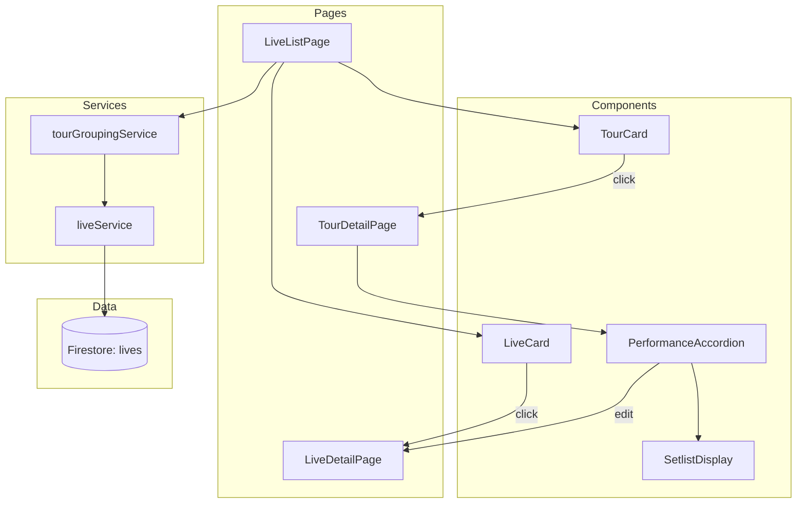

# Design Document: Tour Grouping

## Overview

ツアーグループ化機能は、既存のライブ管理機能を拡張し、同じツアー名を持つ複数のライブ公演をグループ化して表示する機能です。この機能により、ユーザーはツアー単位でライブを把握し、公演地別にセトリを比較できるようになります。

### 設計方針

1. **既存データ構造の活用**: 新しいFirestoreコレクションは作成せず、既存の`lives`コレクションのデータをクライアント側でグループ化
2. **非破壊的拡張**: 既存のLiveListPage、LiveDetailPageの機能を維持しつつ、ツアー表示を追加
3. **コンポーネント分離**: グループ化ロジックをサービス層に、表示をコンポーネント層に分離

## Architecture



## Components and Interfaces

### 1. TourGroup 型定義

```typescript
/**
 * ツアーグループ
 * 同じツアー名を持つ複数の公演をグループ化したデータ構造
 */
interface TourGroup {
  /** グループID（ツアー名のハッシュまたは最初の公演ID） */
  id: string
  /** ツアー名 */
  tourName: string
  /** グループ内の公演リスト（日時昇順） */
  performances: Live[]
  /** 公演数 */
  performanceCount: number
  /** 最初の公演日時（代表日時） */
  firstDate: string
  /** 最後の公演日時 */
  lastDate: string
}

/**
 * グループ化されたライブ一覧の項目
 * ツアーグループまたは単独ライブのいずれか
 */
type GroupedLiveItem = 
  | { type: 'tour'; data: TourGroup }
  | { type: 'live'; data: Live }
```

### 2. tourGroupingService

```typescript
/**
 * ツアーグループ化サービス
 * ライブデータをツアー名でグループ化するロジックを提供
 */
class TourGroupingService {
  /**
   * ライブリストをグループ化
   * - liveType='tour'のライブを同じtitleでグループ化
   * - liveType='solo'/'festival'は個別項目として返す
   * @param lives ライブデータの配列
   * @returns グループ化されたアイテムの配列（日時降順）
   */
  groupLives(lives: Live[]): GroupedLiveItem[]
  
  /**
   * ツアーグループを生成
   * @param tourName ツアー名
   * @param performances 公演リスト
   * @returns TourGroup
   */
  createTourGroup(tourName: string, performances: Live[]): TourGroup
  
  /**
   * グループ化されたアイテムを日時でソート
   * @param items グループ化されたアイテム
   * @returns ソートされたアイテム（降順）
   */
  sortGroupedItems(items: GroupedLiveItem[]): GroupedLiveItem[]
}
```

### 3. TourCard コンポーネント

```typescript
interface TourCardProps {
  /** ツアーグループデータ */
  tourGroup: TourGroup
  /** クリック時のコールバック */
  onClick: (tourGroup: TourGroup) => void
}

/**
 * TourCard コンポーネント
 * ツアーグループをカード形式で表示
 * - ツアー名
 * - 公演数
 * - 開催期間（最初〜最後の公演日）
 * - 公演地プレビュー（最大3件）
 */
function TourCard({ tourGroup, onClick }: TourCardProps): JSX.Element
```

### 4. PerformanceAccordion コンポーネント

```typescript
interface PerformanceAccordionProps {
  /** 公演データ */
  performance: Live
  /** 楽曲データ（セトリ表示用） */
  songs: Song[]
  /** 展開状態 */
  isExpanded: boolean
  /** 展開/折りたたみ切り替えコールバック */
  onToggle: () => void
  /** 楽曲クリック時のコールバック */
  onSongClick?: (songId: string) => void
  /** 編集ボタンクリック時のコールバック */
  onEditClick?: (liveId: string) => void
}

/**
 * PerformanceAccordion コンポーネント
 * 公演情報をアコーディオン形式で表示
 * - ヘッダー: 公演地、会場名、日時
 * - 展開時: セトリ、編集ボタン
 */
function PerformanceAccordion(props: PerformanceAccordionProps): JSX.Element
```

### 5. TourDetailPage

```typescript
/**
 * TourDetailPage コンポーネント
 * ツアー詳細ページ - 公演地別にセトリを表示
 * 
 * URL: /tours/:tourName
 * tourNameはURLエンコードされたツアー名
 */
function TourDetailPage(): JSX.Element
```

## Data Models

### 既存データ構造（変更なし）

```typescript
// 既存のLive型をそのまま使用
interface Live {
  id: string
  liveType: LiveType  // 'tour' | 'solo' | 'festival'
  title: string       // ツアー名（グループ化のキー）
  venueName: string
  dateTime: string
  tourLocation?: string  // 公演地（ツアーの場合）
  setlist: SetlistItem[]
  createdAt?: string
  updatedAt?: string
}
```

### 新規データ構造

```typescript
/**
 * ツアーグループ
 * クライアント側で生成される仮想的なデータ構造
 * Firestoreには保存しない
 */
interface TourGroup {
  id: string              // 一意識別子（最初の公演IDを使用）
  tourName: string        // ツアー名（Live.titleと同じ）
  performances: Live[]    // 公演リスト（日時昇順）
  performanceCount: number
  firstDate: string       // 最初の公演日時
  lastDate: string        // 最後の公演日時
}

/**
 * グループ化されたライブ一覧の項目
 */
type GroupedLiveItem = 
  | { type: 'tour'; data: TourGroup }
  | { type: 'live'; data: Live }
```

## Correctness Properties

*A property is a characteristic or behavior that should hold true across all valid executions of a system-essentially, a formal statement about what the system should do. Properties serve as the bridge between human-readable specifications and machine-verifiable correctness guarantees.*

### Property 1: Tour grouping correctness

*For any* list of Live objects, when groupLives is called, all Live objects with liveType='tour' and the same title SHALL be grouped into the same TourGroup, and all Live objects with liveType='solo' or 'festival' SHALL be returned as individual items.

**Validates: Requirements 1.1, 1.2**

### Property 2: Tour group ordering and dates

*For any* TourGroup, the performances array SHALL be sorted by dateTime in ascending order, firstDate SHALL equal the minimum dateTime among all performances, and lastDate SHALL equal the maximum dateTime among all performances.

**Validates: Requirements 1.3, 1.4**

### Property 3: Performance count consistency

*For any* TourGroup, performanceCount SHALL equal the length of the performances array.

**Validates: Requirements 1.5**

### Property 4: Grouped items sort order

*For any* array of GroupedLiveItem returned by groupLives, the items SHALL be sorted by their representative date (firstDate for tours, dateTime for individual lives) in descending order.

**Validates: Requirements 2.5**

### Property 5: TourCard display completeness

*For any* TourGroup rendered by TourCard, the output SHALL contain the tourName, performanceCount, date range (firstDate to lastDate), and at most 3 tourLocation values from the performances.

**Validates: Requirements 2.2, 2.3**

### Property 6: PerformanceAccordion header completeness

*For any* Live object rendered by PerformanceAccordion, the header SHALL contain the tourLocation (if present), venueName, and formatted dateTime.

**Validates: Requirements 3.3**

## Error Handling

### グループ化エラー

| エラー状況 | 対応 |
|-----------|------|
| ライブデータ取得失敗 | 既存のエラーハンドリングを使用（ErrorMessage表示、リトライボタン） |
| 空のライブリスト | 空状態メッセージを表示（既存の実装を流用） |
| 不正なdateTime形式 | 文字列としてそのまま表示、ソートは文字列比較にフォールバック |

### ナビゲーションエラー

| エラー状況 | 対応 |
|-----------|------|
| 存在しないツアー名でアクセス | エラーメッセージ表示、ライブ一覧へのリンク提供 |
| 公演データが見つからない | エラーメッセージ表示、リトライボタン |

## Testing Strategy

### Unit Tests

- `tourGroupingService.groupLives`: 各種ライブタイプの組み合わせでグループ化が正しく動作することを確認
- `tourGroupingService.createTourGroup`: TourGroupの各フィールドが正しく計算されることを確認
- `TourCard`: 必要な情報が表示されることを確認
- `PerformanceAccordion`: 展開/折りたたみ状態の切り替えが正しく動作することを確認

### Property-Based Tests

Property-based testing library: **fast-check** (TypeScript/JavaScript用)

各プロパティテストは最低100回のイテレーションで実行する。

1. **Property 1テスト**: ランダムなLiveリストを生成し、グループ化結果を検証
   - Tag: **Feature: tour-grouping, Property 1: Tour grouping correctness**

2. **Property 2テスト**: ランダムなTourGroupを生成し、ソート順と日付を検証
   - Tag: **Feature: tour-grouping, Property 2: Tour group ordering and dates**

3. **Property 3テスト**: ランダムなTourGroupを生成し、performanceCountを検証
   - Tag: **Feature: tour-grouping, Property 3: Performance count consistency**

4. **Property 4テスト**: ランダムなGroupedLiveItem配列を生成し、ソート順を検証
   - Tag: **Feature: tour-grouping, Property 4: Grouped items sort order**

5. **Property 5テスト**: ランダムなTourGroupを生成し、TourCardの表示内容を検証
   - Tag: **Feature: tour-grouping, Property 5: TourCard display completeness**

6. **Property 6テスト**: ランダムなLiveを生成し、PerformanceAccordionヘッダーの表示内容を検証
   - Tag: **Feature: tour-grouping, Property 6: PerformanceAccordion header completeness**

### Integration Tests

- ライブ一覧ページでツアーがグループ化されて表示されることを確認
- ツアーカードクリックでツアー詳細ページに遷移することを確認
- ツアー詳細ページでアコーディオンの展開/折りたたみが動作することを確認
- 編集ボタンから編集ページへの遷移を確認

